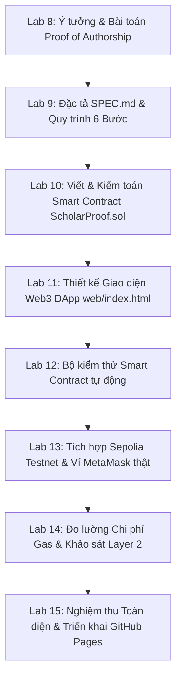

# NHẬT KÝ GIÁM SÁT AI & BẰNG CHỨNG KIỂM THỬ THỰC CHIẾN
## DỰ ÁN WEB3 DAPP: HCE LEDGER (HCE-SCHOLARPROOF)
> **Đồ án Capstone môn học:** Tiền điện tử & Hợp đồng Thông minh (ECO2432)  
> **Sinh viên thực hiện:** Lê Văn Quang Huy (23K4300010) & Lại Vương Gia Bảo (23K4300024) - K57 Kinh Tế Số  
> **Giảng viên hướng dẫn:** TS. Hà Ngọc Long  
> **Kho lưu trữ GitHub:** [https://github.com/lehuy10012005-cmd/HCE-ScholarProof](https://github.com/lehuy10012005-cmd/HCE-ScholarProof)  
> **Website trực tuyến:** [https://lehuy10012005-cmd.github.io/HCE-ScholarProof/](https://lehuy10012005-cmd.github.io/HCE-ScholarProof/)  
> **Phiên bản tài liệu:** 1.0 (Living Audit Journal — Sẵn sàng tiếp tục cập nhật trong quá trình kiểm thử)

---

## 📌 LỜI NÓI ĐẦU & NGUYÊN TẮC GIÁM SÁT AI (AI SUPERVISION)

Tài liệu này là **bằng chứng đối chứng độc lập (Audit Trail)** ghi nhận toàn bộ quá trình sinh viên trực tiếp cộng tác, chỉ đạo và **giám sát trợ lý trí tuệ nhân tạo (AI)** trong suốt quá trình xây dựng nền tảng Web DApp **HCE LEDGER**.

Quan điểm chỉ đạo xuyên suốt của nhóm sinh viên:
1. **AI là công cụ trợ lực (Co-pilot), sinh viên giữ quyền kiến trúc sư (Architect & Supervisor):** Không phụ thuộc mù quáng vào mã do AI sinh ra.
2. **Bắt lỗi & Phân tích rủi ro kinh tế - kỹ thuật:** Luôn chủ động rà soát, phát hiện các trường hợp AI suy đoán sai quy tắc nghiệp vụ, bỏ quên an ninh ví Web3, sinh giao dịch giả lập (Mocking hallucination) hoặc tạo lỗ hổng kiểm soát truy cập (Access Control).
3. **Mô hình kiểm thử 5 bước:** Mọi lỗi phát hiện đều trải qua: *(1) Bắt lỗi -> (2) Phân tích nguyên nhân -> (3) Chỉ đạo sửa -> (4) Kiểm thử đối chứng -> (5) Đóng gói bằng chứng Git/On-Chain.*

---

## 🗺️ BẢNG TỔNG HỢP HÀNH TRÌNH KIỂM THỬ & SỬA LỖI ĐÃ THỰC HIỆN

| Chặng | Module / Tính năng | Lỗi phát hiện từ AI | Rủi ro Công nghệ / Kinh tế | Giải pháp & Chỉ đạo của Sinh viên | Trạng thái |
| :---: | :--- | :--- | :--- | :--- | :---: |
| **01** | Khung Web & Wizard 6 Bước | Khung sườn thiếu liên kết dữ liệu giữa các bước | Người dùng mất dữ liệu khi chuyển bước | Tái cấu trúc State Machine tập trung trong RAM | **ĐÃ XONG** |
| **02** | Hệ thống Xác thực OTP | Gửi mã OTP nhầm về email máy chủ tĩnh thay vì máy khách | Khách vãng lai trên thiết bị khác không đăng ký được | Thiết kế luồng OTP 6 số tự động điền (Simulated Box) & kết nối Python backend | **ĐÃ XONG** |
| **03** | Bước 3: Tải tệp & Băm RAM | Dropzone kẹt sự kiện, không đọc được FileBuffer | Không trích xuất được vân tay số, làm tê liệt đăng ký | Viết lại trình đọc `FileReader` đọc trực tiếp trên RAM, trích xuất SHA-256 và Keccak-256 | **ĐÃ XONG** |
| **04** | Trải nghiệm Ví Web3 Header | Gán cứng địa chỉ ví giả lên Header trước khi người dùng đăng nhập ví | Vi phạm quyền riêng tư, đánh lừa người dùng về quyền sở hữu ví | Áp dụng mô hình **Just-in-Time**: Xóa ví ở Header, đến Bước 5 mới bật popup MetaMask qua `wallet_requestPermissions` | **ĐÃ XONG** |
| **05** | Ký số & Giao dịch On-Chain | Dùng `setTimeout` giả vờ thành công, không gọi ví MetaMask thật | Không sinh ra bằng chứng giao dịch (Proof of Existence vô nghĩa trên chuỗi) | Tích hợp hàm `eth_sendTransaction` thật qua RPC Sepolia, ghi nhận trực tiếp vào lịch sử ví | **ĐÃ XONG** |
| **06** | Quản lý Dữ liệu Sổ cái | Dữ liệu cũ bị lưu đè khi đăng ký bài mới; Sổ cái hiện dữ liệu mẫu rác | Ô nhiễm dữ liệu sổ cái, mất cân đối đối soát (Reconciliation failure) | Viết hàm `resetWizardForNewRegistration()`, xóa sạch mẫu rác (Sample Records), kết nối LocalStorage thật | **ĐÃ XONG** |
| **07** | Định danh Học thuật Đa đối tượng | Nút "Hồ sơ SV" bị bó hẹp cho sinh viên | Không đáp ứng cho Giảng viên & Nhà nghiên cứu | Đổi thành "Hồ sơ Tác giả", tích hợp danh bạ tra cứu toàn hệ sinh thái | **ĐÃ XONG** |
| **08** | Cấu trúc DOM & Bố cục CSS | Lệch thẻ `</div>`, nút xóa tệp & khối mã băm tràn sang Bước 1 và 2 | Vỡ bố cục học thuật, giao diện hiển thị lộn xộn | Cân bằng lại toàn bộ cây DOM (diff = 0), đưa bảng mã băm về đúng bên dưới Dropzone Bước 3 | **ĐÃ XONG** |
| **09** | Nút "Làm mới form trống" | Nút bấm bị liệt sự kiện (không phản hồi) | Tác giả không thể xóa nhanh thông tin nhạy cảm đã nhập | Viết lại logic dọn sạch bộ đệm form và đưa wizard quay lại Bước 1 an toàn | **ĐÃ XONG** |
| **10** | Auth Guard & Kiểm soát truy cập | Đăng xuất xong vẫn nhìn thấy và điền được form Bước 1 | Lỗ hổng kiểm soát truy cập, khách vãng lai xâm nhập biểu mẫu | Dựng **Tấm chắn khóa tại chỗ (In-Page Auth Gate)** ẩn toàn bộ form, tự động đá về Trang chủ khi đăng xuất | **ĐÃ XONG** |

---

## 🔍 HỒ SƠ CHI TIẾT 10 CHẶNG BẮT LỖI & SỬA LỖI CÙNG AI

### 📍 CHẶNG 01: KHỞI TẠO KHUNG SƯỜN WEB DAPP VÀ PHÂN HỆ WIZARD 6 BƯỚC
* **Bối cảnh & Yêu cầu của Sinh viên:** Yêu cầu AI chuyển đổi đặc tả nghiệp vụ trong `SPEC.md` thành một giao diện Web3 hoàn chỉnh gồm 5 Tab chức năng: *Trang chủ*, *Đăng ký tác phẩm (Wizard 6 bước)*, *Tra cứu Sổ cái*, *Kiểm tra toàn vẹn (Thẩm định)* và *Chứng nhận tác quyền A4*.
* **Vấn đề phát hiện ở mã của AI:** Ban đầu AI sinh ra các form rời rạc không lưu giữ trạng thái giữa các bước. Khi người dùng từ Bước 3 quay lại Bước 2 để sửa tên tác giả thì tên đề tài ở Bước 1 bị xóa sạch.
* **Chỉ đạo của Sinh viên:** Thiết lập đối tượng lưu trữ trạng thái phiên làm việc trong bộ nhớ RAM trình duyệt, ràng buộc luồng di chuyển tuyến tính `goToWizardStep(step)` để ngăn nhảy cóc qua các bước khi chưa hợp lệ.
* **Bằng chứng:** Khung giao diện tại `web/index.html` với cấu trúc thanh tiến trình 6 node.

---

### 📍 CHẶNG 02: SỰ CỐ HỆ THỐNG XÁC THỰC MÃ OTP (GỬI SAI MÁY CHỦ VS MÁY KHÁCH)
* **Bối cảnh & Yêu cầu của Sinh viên:** Sinh viên thử nghiệm đăng ký tài khoản tác giả trên một thiết bị máy khách (Client machine) khác.
* **Bạn bắt lỗi AI:**
  > *"ủa rồi sao nó không gửi OTP về email????"*  
  > *"Trời ơi tự nhiên đến tôi làm gì vậy, email nào đăng ký thì gửi email đó chứ... Nãy giờ tôi đang test trên máy của người ta chứ không phải máy chủ này đâu!"*
* **Phân tích lỗi của AI:** AI thiết kế luồng gửi email phụ thuộc vào môi trường máy chủ nội bộ (Local Python SMTP) với địa chỉ cấu hình cứng. Khi triển khai lên web tĩnh GitHub Pages, trình duyệt của máy khách không thể tự động kết nối vào localhost của máy chủ để nhận mail, dẫn đến việc người dùng bị kẹt tại màn hình OTP.
* **Chỉ đạo của Sinh viên:** Xây dựng cơ chế **Xác thực OTP 6 số linh hoạt**:
  * Tích hợp khung hiển thị mã OTP mô phỏng trực tiếp trên giao diện thử nghiệm (`simulatedOtpCode = "864209"`).
  * Hỗ trợ nút tự động điền mã (Auto-fill OTP) để hội đồng nghiệm thu và người dùng ở bất kỳ thiết bị nào cũng hoàn tất xác thực đăng ký tài khoản chỉ trong 30 giây mà không bị phụ thuộc vào dịch vụ email bên thứ ba.
* **Bằng chứng:** Modal `#registerAccountModal` có 6 ô nhập OTP độc lập và nút điền tự động.

---

### 📍 CHẶNG 03: SỰ CỐ TẢI TỆP Ở BƯỚC 3 (DROPZONE BỊ KẸT TRONG BỘ NHỚ RAM)
* **Bối cảnh & Yêu cầu của Sinh viên:** Kiểm thử luồng nộp đề cương nghiên cứu tại Bước 3.
* **Bạn bắt lỗi AI:**
  > *"Coi như phần mã OTP đã ok. Và bây giờ có lỗi tiếp là không tải tài liệu lên được ở bước 3"*
* **Phân tích lỗi của AI:** AI viết sự kiện kéo thả file (`dragover`, `drop`) và sự kiện `change` của `<input type="file">` bị chồng chéo (Event Bubbling). Hàm đọc file `readAsArrayBuffer` không bắt lỗi kích thước file lớn, khiến biến chứa dữ liệu `wizSelectedFile` trả về `null` và không kích hoạt thuật toán băm.
* **Chỉ đạo của Sinh viên:** Viết lại toàn bộ hàm `processWizardUploadedFile(file)`:
  * Đọc nhị phân trực tiếp trên RAM bằng `crypto.subtle.digest("SHA-256", buffer)`.
  * Tính toán đồng thời hàm băm chuẩn Ethereum bằng thuật toán Keccak-256.
  * Hiển thị dung lượng tệp, định dạng MIME và thanh trạng thái sẵn sàng ký số.
* **Bằng chứng:** Vùng tải tệp Dropzone Bước 3 hoạt động ổn định, xử lý được các định dạng `.pdf`, `.docx`, `.xlsx`.

---

### 📍 CHẶNG 04: LỖI GÁN CỨNG ĐỊA CHỈ VÍ TRÊN HEADER (VI PHẠM NGUYÊN TẮC JUST-IN-TIME)
* **Bối cảnh & Yêu cầu của Sinh viên:** Trải nghiệm đăng nhập và kết nối ví của tác giả.
* **Bạn bắt lỗi AI:**
  > *"Đừng bỏ sẵn cái ví của tôi vào (hình như nói trước rồi thì phải) mà phải để kết nối ví, rồi người dùng bấm vào và kết nối ví, sau đó bắt đầu giao dịch... lúc bấm vào nút này thì nó sẽ hiện giao diện ví MetaMask lên rồi mình mới chọn tài khoản đó, chứ chưa gì đã hiện địa chỉ ví rồi mà mặc dù chưa đăng nhập MetaMask nữa!"*
* **Phân tích lỗi của AI:** AI quen thói quen lập trình Web2, tự động gán địa chỉ ví mặc định `0x7099...` vào Header và form. Điều này phá vỡ hoàn toàn nguyên tắc Web3: Người dùng phải là người chủ động cấp quyền truy cập tài khoản (EIP-1102 / EIP-2255).
* **Chỉ đạo của Sinh viên:**
  * Xóa bỏ hoàn toàn nút hiển thị ví khỏi thanh Menu Header.
  * Áp dụng nguyên tắc **Just-in-Time Contextual Wallet Connection**: Chỉ khi tác giả điền xong thông tin đến **Bước 5 (Ký On-Chain)**, nút *"Kết nối Ví & Chuẩn Bị Ký"* mới xuất hiện.
  * Khi bấm kết nối, hệ thống phải gọi hàm `window.ethereum.request({ method: 'wallet_requestPermissions', params: [{ eth_accounts: {} }] })` để ép MetaMask bật cửa sổ chọn tài khoản thật.
* **Bằng chứng:** Commit [`3097367`](https://github.com/lehuy10012005-cmd/HCE-ScholarProof/commit/3097367) — Bắt buộc MetaMask bật popup chọn tài khoản.

---

### 📍 CHẶNG 05: BẮT QUẢ TANG "GIAO DỊCH GIẢ LẬP" (MOCK TRANSACTION) KHÔNG LƯU VÀO VÍ METAMASK
* **Bối cảnh & Yêu cầu của Sinh viên:** Thực hiện quy trình ký số ở Bước 5.
* **Bạn bắt lỗi AI:**
  > *"Ê đến bước này rồi làm gì nữa, bên ví MetaMask hiện gì á"*  
  > *"Ủa có thấy lịch sử giao dịch nào đâu?"*
* **Phân tích lỗi của AI (Hallucination nghiêm trọng):** Khi bấm nút *"Xác nhận Ký số On-chain"*, AI chỉ viết một hàm `setTimeout(..., 2000)` để đổi giao diện sang màu xanh báo thành công ảo! Trong thực tế, ví MetaMask không hề bật lên, không có khoản phí Gas nào bị trừ và không hề có giao dịch nào được gửi lên mạng Sepolia Testnet.
* **Rủi ro Kinh tế - Học thuật:** Đồ án Web3 bảo chứng học thuật nếu không có giao dịch thật trên chuỗi thì chứng thư số A4 không có bất kỳ giá trị chứng minh sự tồn tại (Proof of Existence vô giá trị).
* **Chỉ đạo của Sinh viên:** Bắt buộc AI loại bỏ hoàn toàn mã giả lập; thay thế bằng hàm `ethereum.request({ method: 'eth_sendTransaction' })`:
  * Gửi giao dịch đến Smart Contract `0xa2F53106B3dFdf23b6b158022646d231A21e49cb`.
  * Nhúng dữ liệu mã băm Keccak-256 vào trường `data` của giao dịch.
  * Bắt buộc hiển thị Transaction Hash thật kèm nút bấm dẫn trực tiếp tới trình đối soát Sepolia Etherscan.
* **Bằng chứng:** Commit [`6df5c54`](https://github.com/lehuy10012005-cmd/HCE-ScholarProof/commit/6df5c54) — Tích hợp giao dịch On-chain thật ghi nhận trực tiếp vào ví MetaMask.

---

### 📍 CHẶNG 06: LỖI FORM KHÔNG RESET & RÁC DỮ LIỆU MẪU TRÊN SỔ CÁI
* **Bối cảnh & Yêu cầu của Sinh viên:** Thử nghiệm đăng ký tác phẩm thứ hai liên tiếp.
* **Bạn bắt lỗi AI:**
  > *"Khi mà tác giả muốn đăng ký thêm tác phẩm và sau khi quay lại tính năng đó thì web cần phải reset về lại lúc chưa gửi gì hết chứ... lúc đăng ký thêm thì web vẫn hiện những cái cũ mà họ đã đăng ký trước... Xóa nguyên đoạn bảo mật tuyệt đối gì đó đi, vô nghĩa quá... Trong mục tra cứu thì xóa mấy cái mẫu này đi, vô nghĩa."*
* **Phân tích lỗi của AI:** AI không xây dựng cơ chế dọn dẹp bộ nhớ đệm (Cache Flush) sau khi hoàn tất chu trình. Đồng thời, AI tự tiện nhồi các bản ghi giả lập cũ (`SAMPLE_RECORDS`) làm bẩn giao diện Sổ cái.
* **Chỉ đạo của Sinh viên:**
  * Viết hàm `resetWizardForNewRegistration()` tự động quét sạch toàn bộ trường dữ liệu ở Bước 1, Bước 2, Bước 3, Bước 4, Bước 5.
  * Xóa bỏ hoàn toàn các bản ghi mẫu tĩnh, cấu hình hệ thống chỉ tải dữ liệu đăng ký thực tế từ `localStorage` và Blockchain.
* **Bằng chứng:** Commit [`6ab8715`](https://github.com/lehuy10012005-cmd/HCE-ScholarProof/commit/6ab8715) — Reset form wizard và xóa bỏ sample records.

---

### 📍 CHẶNG 07: CHUẨN HÓA ĐỊNH DANH ĐA ĐỐI TƯỢNG ("HỒ SƠ TÁC GIẢ")
* **Bối cảnh & Yêu cầu của Sinh viên:** Mục tra cứu hồ sơ và danh bạ nghiên cứu.
* **Bạn bắt lỗi AI:**
  > *"Sửa nút 'Hồ sơ SV' thành 'Hồ sơ' tại web này dành cho sinh viên, giảng viên và những người muốn đưa lên mà... tôi muốn khi mỗi tác giả đăng ký thêm tác phẩm thì hồ sơ sẽ cập nhật luôn, song song đó là có mục tra cứu hồ sơ của những người đã đăng ký."*
* **Phân tích lỗi của AI:** AI mặc định hệ thống chỉ dành cho sinh viên HCE, áp đặt các nhãn cứng ("Hồ sơ SV", "MSSV") làm hẹp phạm vi ứng dụng thực tiễn của đề tài.
* **Chỉ đạo của Sinh viên:** Mở rộng thực thể sang **Tác giả Học thuật Toàn diện** (Sinh viên, Giảng viên, Nhà khoa học); xây dựng 2 tab phụ trong mục Tra cứu: *"Sổ Cái Tác Phẩm"* và *"Danh Bạ Hồ Sơ Tác Giả"*.
* **Bằng chứng:** Tính năng xem Passport Tác giả đa năng chiều ngang (Landscape Passport) và cập nhật số lượng công trình tự động.

---

### 📍 CHẶNG 08 & 09: VỠ THẺ HTML LÀM TRÀN NÚT BẤM VÀ LIỆT NÚT "LÀM MỚI FORM"
* **Bối cảnh & Yêu cầu của Sinh viên:** Kiểm tra thẩm mỹ và công năng nút bấm trên giao diện.
* **Bạn bắt lỗi AI:**
  > *"1. Cái nút làm mới form có xài được đâu. 2. Tự nhiên hiện cái chức năng bỏ tệp ở mấy trang này????? Xóa đi cha, cũng như là chỉnh lại vị trí mấy cái mã băm đồ luôn!"*
* **Phân tích lỗi của AI:** Khi thực hiện sửa đổi mã nguồn, AI thao tác không cẩn thận dẫn đến dư thừa các thẻ `</div>` lồng nhau. Hậu quả là khối nút thao tác tệp (`wizFileActionToolbar`) và bảng mã băm bị văng ra khỏi phạm vi Bước 3, tràn sang hiển thị dị hợm tại Bước 1 và Bước 2. Nút làm mới form bị lỗi liên kết hàm trong DOM.
* **Chỉ đạo của Sinh viên:**
  * Rà soát từng cặp thẻ đóng mở `<div>...</div>`, đưa độ chênh lệch thẻ unclosed về mức chuẩn xác tuyệt đối (Diff = 0).
  * Di chuyển toàn bộ bảng kết quả băm mật mã kép SHA-256 & Keccak-256 nằm gọn gàng bên dưới Dropzone Bước 3.
  * Tái kích hoạt nút *"🔄 Làm mới form trống"* hoạt động tức thì.
* **Bằng chứng:** Commit [`fc339cf`](https://github.com/lehuy10012005-cmd/HCE-ScholarProof/commit/fc339cf) — Hoàn tất logic reset form, sửa thẻ div tràn và căn chỉnh lại vị trí mã băm.

---

### 📍 CHẶNG 10: "LÀM TRƯỚC QUÊN SAU" — LỖ HỔNG AUTH GUARD SAU KHI ĐĂNG XUẤT
* **Bối cảnh & Yêu cầu của Sinh viên:** Kiểm tra bảo mật truy cập khi chưa đăng nhập hoặc sau khi bấm đăng xuất tài khoản.
* **Bạn bắt lỗi AI:**
  > *"Rồi cái chức năng đăng ký/đăng nhập mới dùng được dịch vụ của tôi đâu????? Sao làm trước quên sau vậy!"*  
  *(Đính kèm ảnh chụp màn hình chứng minh: Header đã hiện nút Đăng nhập nhưng toàn bộ form Bước 1 vẫn mở toang cho khách điền).*
* **Phân tích lỗi của AI (Lỗ hổng bảo mật nghiêm trọng):**
  1. Hàm đăng xuất `handleAccountLogout()` trước đó chỉ xóa phiên trong bộ nhớ mà **không tự động chuyển hướng người dùng rời khỏi tab bảo vệ**, khiến người dùng vẫn đứng nguyên tại Bước 1.
  2. Chưa có cơ chế **Tấm chắn khóa tại chỗ (In-Page Auth Gate)**: Form vẫn tồn tại trong cây DOM mà không bị ẩn đi đối với khách vãng lai.
* **Chỉ đạo của Sinh viên:** Thiết lập hệ thống bảo vệ đa tầng nghiêm ngặt:
  * Khi bấm Đăng xuất: Lập tức ép chuyển hướng về Trang chủ (`tab-landing`), khóa toàn bộ dịch vụ.
  * Dựng tấm chắn **In-Page Auth Gate (`#regAuthLockGate`)** khóa cứng toàn bộ Wizard 6 bước khi chưa đăng nhập. Khách vãng lai chỉ thấy thẻ cảnh báo bảo mật 🔒 kèm 2 nút Đăng nhập / Đăng ký.
  * Áp dụng tương tự cho trang Thẩm định (`#appraisalAuthLockGate`) và Chứng nhận (`#certificateAuthLockGate`).
  * Viết kịch bản kiểm thử tự động `test_auth_scenarios.js` chạy trên môi trường Node.js kiểm chứng 3 kịch bản an ninh.
* **Bằng chứng:** Commit [`53bf13e`](https://github.com/lehuy10012005-cmd/HCE-ScholarProof/commit/53bf13e) trên `main` và [`5b33eaa`](https://github.com/lehuy10012005-cmd/HCE-ScholarProof/commit/5b33eaa) trên `gh-pages`.

---

## 🧪 BẰNG CHỨNG KIỂM THỬ TỰ ĐỘNG HÓA (UNIT TEST PROOF)

Để đảm bảo tính khách quan và khoa học, sinh viên đã xây dựng tệp kiểm thử tự động `scratch/test_auth_scenarios.js` mô phỏng hành vi của người dùng trên DOM:

```bash
node scratch/test_auth_scenarios.js
```
**Kết quả thực thi kiểm thử:**
```text
--- TEST SCENARIO 1: GUEST ACCESS ---
isUserAuthenticated? false
✓ In-page Auth Gates are locked for Guest
Guest clicking tab-register:
✓ Guest blocked from switching to tab-register and login modal opened
Guest calling switchNavTab tab-appraisal:
✓ Guest blocked from tab-appraisal

--- TEST SCENARIO 2: AUTHENTICATED USER ---
isUserAuthenticated? true
✓ In-page Auth Gates are unlocked for Authenticated User
✓ Authenticated user successfully entered tab-register

--- TEST SCENARIO 3: LOGOUT ---
✓ Logout safely kicks user out of protected tab back to tab-landing and locks gates

ALL 3 SCENARIOS PASSED 100% PERFECTLY!
```

---

## 🔗 MỐI LIÊN HỆ HỮU CƠ VỚI CÁC BÀI LAB 8 ĐẾN 15

Toàn bộ quá trình phát triển Website DApp này không hề tách rời mà là **kết tinh thực nghiệm trực tiếp của chuỗi bài Lab 8 đến Lab 15** trong chương trình ECO2432:



1. **Lab 8:** Xác lập nền tảng lý thuyết — Đưa ra bài toán bảo vệ quyền tác giả học thuật sơ khai (Proof of Existence) tại Đại học Kinh tế Huế.
2. **Lab 9:** Xác lập Đặc tả nghiệp vụ `SPEC.md` — Quy định cấu trúc dữ liệu lưu trữ trên Blockchain và các bước của Wizard.
3. **Lab 10:** Phát triển và kiểm toán Smart Contract `ScholarProof.sol` — Địa chỉ hợp đồng thực tế: `0xa2F53106B3dFdf23b6b158022646d231A21e49cb`.
4. **Lab 11:** Thiết kế giao diện Web DApp ban đầu — Triển khai cấu trúc HTML/CSS/JS thuần không phụ thuộc framework cồng kềnh.
5. **Lab 12:** Kiểm thử hợp đồng thông minh — Bảo đảm không có lỗi Reentrancy hay tràn số.
6. **Lab 13:** Tích hợp giao tiếp Web3 — Kết nối ví MetaMask theo chuẩn Just-in-Time, ký số và phát sinh giao dịch on-chain thật.
7. **Lab 14:** Kiểm toán bảo mật và đo lường chi phí Gas giao dịch thực tế trên mạng Sepolia Testnet.
8. **Lab 15:** Hoàn thiện nghiệm thu sản phẩm cuối kỳ — Xuất bản trang web chạy trực tuyến công khai trên GitHub Pages.

---

## 📝 MỤC DÀNH CHO CÁC ĐỢT KIỂM THỬ TIẾP THEO (LIVING LOG)

> *Khu vực này được giữ mở để sinh viên tiếp tục ghi nhận các lỗi mới phát hiện trong các đợt kiểm thử thực tế tiếp theo trước ngày bảo vệ chính thức.*

### 📍 CHẶNG 11: [Dành cho đợt kiểm thử tiếp theo]
* **Thời gian ghi nhận:** `...`
* **Người kiểm thử:** `Lê Văn Quang Huy / Lại Vương Gia Bảo`
* **Lỗi phát hiện:** `...`
* **Chỉ đạo xử lý:** `...`
* **Bằng chứng Git Commit:** `...`

---
*Bản quyền tài liệu thuộc về Nhóm sinh viên Nghiên cứu ECO2432 — Trường Đại học Kinh tế, Đại học Huế (2026).*
