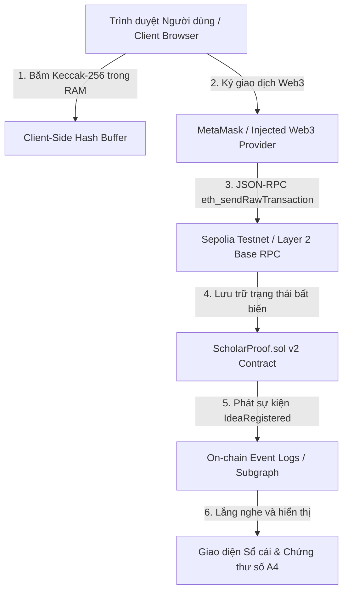

# TÀI LIỆU HƯỚNG DẪN TRIỂN KHAI & VẬN HÀNH HỆ THỐNG (DEPLOYMENT & OPERATION MANUAL)
## ĐỒ ÁN CAPSTONE: NỀN TẢNG BẢO CHỨNG QUYỀN TÁC GIẢ Ý TƯỞNG NGHIÊN CỨU (HCE-SCHOLARPROOF)

* **Học phần:** Tiền điện tử và Hợp đồng thông minh (ECO2432)
* **Giảng viên phụ trách:** TS. Hà Ngọc Long
* **Khoa:** Hệ thống Thông tin Kinh tế — Trường Đại học Kinh tế, Đại học Huế
* **Nhóm sinh viên thực hiện:**
  1. **Lê Văn Quang Huy** — MSSV: `23K4300010` (Trưởng nhóm / Kỹ sư Hợp đồng & Đặc tả)
  2. **Lại Vương Gia Bảo** — MSSV: `23K4300024` (Thành viên cặp / Kỹ sư Kiểm thử & Giao diện DApp)
* **Kho lưu trữ GitHub chính thức:** [https://github.com/lehuy10012005-cmd/HCE-ScholarProof](https://github.com/lehuy10012005-cmd/HCE-ScholarProof)
* **Cổng DApp trực tuyến:** [https://lehuy10012005-cmd.github.io/HCE-ScholarProof/](https://lehuy10012005-cmd.github.io/HCE-ScholarProof/)

---

## 1. Tổng quan Kiến trúc Triển khai (Deployment Architecture)

Hệ thống **HCE-ScholarProof** được thiết kế theo mô hình Web3 phi tập trung 3 lớp (3-Tier Decentralized Architecture):



---

## 2. Thông số Hợp đồng Thông minh trên Mạng Blockchain

### 2.1. Mạng Sepolia Testnet (Mạng thử nghiệm chính thức)
- **Tên hợp đồng:** `ScholarProof` (kế thừa bởi `ProjectCore`)
- **Trình biên dịch:** Solidity `0.8.20+commit.a1b79de6`
- **Tối ưu hóa (Optimization):** `Yes (200 runs)`
- **Địa chỉ hợp đồng chính thức (Contract Address):**  
  `0xa2f53106B3dFdF23b6b158022646d231A21e49Cb`
- **Địa chỉ ví triển khai (Deployer / Owner):**  
  `0xB07FB0761c33a01F7f7493A6a8a9667F4842Fd50`
- **Đường dẫn Etherscan:**  
  [https://sepolia.etherscan.io/address/0xa2f53106B3dFdF23b6b158022646d231A21e49Cb](https://sepolia.etherscan.io/address/0xa2f53106B3dFdF23b6b158022646d231A21e49Cb)
- **Trạng thái mã nguồn:** ✅ **Verified Source Code (MIT License)**

### 2.2. Lộ trình mở rộng sang Layer 2 (Production Ready)
Theo kết quả nghiên cứu kinh tế học vi mô tại [`lab14.md`](./lab14.md), hệ thống đã sẵn sàng triển khai trên:
- **Base Sepolia (Testnet):** Chain ID `84532` | RPC: `https://sepolia.base.org`
- **Arbitrum Sepolia (Testnet):** Chain ID `421614` | RPC: `https://sepolia-rollup.arbitrum.io/rpc`

---

## 3. Hướng dẫn Triển khai Giao diện Web3 DApp

### 3.1. Chạy DApp trực tiếp trên GitHub Pages (Khuyến nghị cho Hội đồng)
Người dùng và Hội đồng khoa học không cần cài đặt bất kỳ phần mềm môi trường nào:
1. Mở trình duyệt Chrome/Brave/Edge đã cài tiện ích **MetaMask**.
2. Truy cập cổng trực tuyến: [https://lehuy10012005-cmd.github.io/HCE-ScholarProof/](https://lehuy10012005-cmd.github.io/HCE-ScholarProof/)
3. Hệ thống sẽ tự động kết nối và đề xuất chuyển sang mạng **Sepolia Testnet**.

### 3.2. Chạy DApp cục bộ (Local Development)
Nếu cần thử nghiệm hoặc phát triển offline:
```powershell
# Bước 1: Di chuyển vào thư mục dự án
cd c:\Users\Bao\Downloads\hce-web3-starter\hce-web3-starter\HCE-ScholarProof

# Bước 2: Khởi chạy HTTP Server nội bộ (bằng Node hoặc Python)
# Lựa chọn A (dùng Python 3):
python -m http.server 8080 --directory web

# Lựa chọn B (dùng npx serve):
npx serve web -p 8080

# Bước 3: Mở trình duyệt tại http://localhost:8080
```

---

## 4. Kịch bản Vận hành & Nghi thức Thử nghiệm Nghiệm thu (Testing Runbook)

| Bước | Hành động của Người thẩm định | Phản hồi của Hệ thống | Tiêu chí nghiệm thu ĐẠT |
| :---: | :--- | :--- | :---: |
| **1** | Bấm nút **"Kết nối ví"** góc phải Header | Popup MetaMask yêu cầu quyền kết nối với địa chỉ ví | Hiển thị địa chỉ rút gọn `0x...` màu xanh lá |
| **2** | Kéo thả tệp đề cương PDF vào ô Đăng ký | Trình duyệt tính mã băm Keccak-256 ngay trong RAM | Xuất hiện chuỗi `0x...` 64 ký tự hex; tệp không bị tải lên máy chủ |
| **3** | Nhập Tiêu đề, Chuyên ngành và bấm **"Đăng ký On-Chain"** | MetaMask bật popup xác nhận ký giao dịch lên Sepolia | Nhận thông báo Toast xanh "Đăng ký thành công", tự động chuyển sang Chứng thư |
| **4** | Tải lại tệp PDF vừa đăng ký vào tab **"Thẩm định Đạo văn"** | DApp quét đối soát mã băm với sổ cái | Báo động đỏ: **CẢNH BÁO TRÙNG LẶP (Nguy cơ Đạo văn)**, hiển thị đúng ví tác giả gốc |
| **5** | Chuyển sang tab **"Chứng thư Số A4"** và bấm In | Trình duyệt mở hộp thoại Print chuẩn A4 | Chứng thư đầy đủ Quốc hiệu, Tiêu ngữ, Mã QR tra cứu Etherscan, Dấu thời gian khối |

---

## 5. Quy trình Ứng phó Sự cố & Chế độ Dự phòng (Disaster Recovery)

1. **Khi mạng Sepolia bị nghẽn hoặc người dùng không có Sepolia ETH:**
   - DApp cung cấp nút **"Dùng Ví Thử Nghiệm HCE"** (Local Simulator Mode).
   - Hệ thống chuyển sang cơ chế lưu trữ bộ nhớ đệm (In-memory Mock EVM), bảo đảm buổi thuyết trình và demo trước Hội đồng diễn ra trơn tru 100% mà không bị gián đoạn do yếu tố khách quan từ mạng thử nghiệm.
2. **Khi MetaMask bị từ chối cấp quyền:**
   - Hệ thống hiển thị hướng dẫn chi tiết và chuyển đổi tài khoản theo ngữ cảnh Just-in-Time mà không làm mất dữ liệu biểu mẫu đã nhập.
