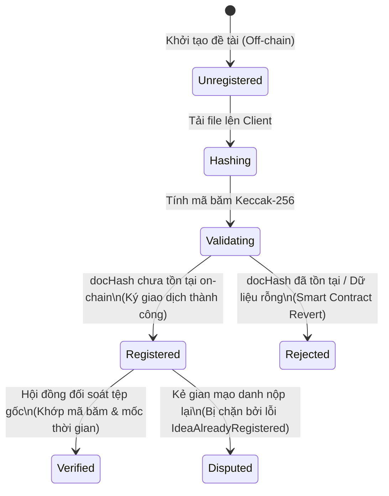

# ĐẶC TẢ NGHIỆP VỤ BA FINTECH: HCE-SCHOLARPROOF
## NỀN TẢNG GHI NHẬN & BẢO CHỨNG QUYỀN TÁC GIẢ Ý TƯỞNG NGHIÊN CỨU KHOA HỌC TRÊN BLOCKCHAIN

* **Học phần:** Tiền điện tử và Hợp đồng thông minh (ECO2432)
* **Đề tài Capstone:** Chủ đề 8 — Ghi nhận quyền tác giả của ý tưởng nghiên cứu khoa học
* **Tác giả (BA / Kỹ sư Hệ thống):**
  1. **Lê Văn Quang Huy** — MSV: `23K4300010` (Trưởng nhóm / Phụ trách Hợp đồng & Đặc tả)
  2. **Lại Vương Gia Bảo** — MSV: `23K4300024` (Thành viên cặp / Phụ trách Kiểm thử & Giao diện DApp)
* **Giảng viên hướng dẫn:** TS. Hà Ngọc Long
* **Kho lưu trữ chính thức:** [https://github.com/lehuy10012005-cmd/HCE-ScholarProof](https://github.com/lehuy10012005-cmd/HCE-ScholarProof)

---

## 1. Mục đích nghiệp vụ (Business Objectives)
Trong môi trường học thuật và nghiên cứu khoa học sinh viên tại Trường Đại học Kinh tế (HCE), giai đoạn sơ khởi của đề tài (ý tưởng đột phá, đề cương chi tiết, mô hình phân tích hoặc tập dữ liệu khảo sát) thường đối mặt với nguy cơ bị **chiếm đoạt ý tưởng (Idea Scooping / Plagiarism)** hoặc tranh chấp quyền ưu tiên công bố (Priority of Discovery). 

Các giải pháp truyền thống (nộp đơn đăng ký bản quyền tại Cục Bản quyền tác giả, lưu trữ email, Google Drive) có chi phí giao dịch cao (vài triệu đồng/hồ sơ), thời gian xét duyệt kéo dài (6–18 tháng) hoặc thiếu tính khách quan do mốc thời gian máy chủ tập trung có thể bị thao túng.

**HCE-ScholarProof** được thiết kế nhằm:
1. Cung cấp cơ chế **Proof of Existence (Chứng minh sự tồn tại mật mã)** và **Immutable Block Timestamping (Ghi dấu thời gian khối bất biến)** trên blockchain cho các ý tưởng nghiên cứu với chi phí vi mô ($\approx 1.000\text{ VNĐ}$ trên Layer 2).
2. Bảo toàn tính riêng tư 100% (Zero-knowledge of Content): Tác giả bảo vệ được ý tưởng mà **không cần công khai nội dung tệp nghiên cứu** ra ngoài trước khi bài báo được xuất bản chính thức.
3. Cung cấp công cụ tra cứu công khai, minh bạch, hoàn toàn miễn phí cho các Hội đồng xét duyệt đề cương, Ban giám khảo NCKH để đối soát bản quyền ưu tiên không thể chối cãi (Non-repudiation).

---

## 2. Các tác nhân hệ thống (Actors & Roles)

| Tác nhân | Định danh | Quyền hạn & Trách nhiệm |
| :--- | :--- | :--- |
| **Nhà nghiên cứu / Tác giả (Author)** | Địa chỉ ví Web3 (`msg.sender`) | Tải tệp nghiên cứu lên client, tính mã băm Keccak-256, ký giao dịch on-chain để xác lập quyền sở hữu trí tuệ đầu tiên. |
| **Hội đồng / Công chúng (Verifier)** | Bất kỳ ai (Không cần ví) | Tải tệp tài liệu nghi vấn lên hệ thống để tra cứu, đối soát mã băm on-chain hoàn toàn miễn phí (hàm `view`). |
| **Hợp đồng thông minh (Smart Contract)** | `ScholarProof.sol` | Tự động hóa 100% logic kiểm tra tính duy nhất của mã băm, ghi nhận thời gian khối, phát sự kiện và từ chối mọi hành vi gian lận nộp đè. Không có quyền can thiệp của admin (Zero Centralization Risk). |

---

## 3. Dữ liệu đầu vào (System Inputs)

### 3.1. Dữ liệu ngoài chuỗi (Off-chain Client Inputs)
* **`fileContent` (Bắt buộc tại Client):** Tệp tài liệu nghiên cứu (PDF, DOCX, CSV, IPYNB, ZIP...) do tác giả tải lên từ máy tính.
* **Nguyên tắc bảo mật:** Tệp tài liệu này **TUYỆT ĐỐI KHÔNG gửi lên máy chủ web hay blockchain**. Quá trình băm diễn ra hoàn toàn trong bộ nhớ RAM trình duyệt của người dùng.

### 3.2. Dữ liệu nạp vào Smart Contract (On-chain Transaction Inputs)
* **`docHash` (Bắt buộc):** Kiểu `bytes32` (chuỗi 32 bytes hex), là giá trị băm Keccak-256 của tệp tài liệu.
* **`title` (Bắt buộc):** Kiểu chuỗi ký tự (`string`), độ dài từ $1$ đến $256$ ký tự, là tiêu đề ý tưởng hoặc tên đề cương nghiên cứu.
* **`category` (Bắt buộc):** Kiểu chuỗi ký tự (`string`), lĩnh vực chuyên môn (ví dụ: `Fintech & Ngân hàng số`, `Kinh tế lượng ứng dụng`, `Kinh tế tuần hoàn`,...).
* **`msg.sender` (Ngầm định):** Địa chỉ ví 42 ký tự của người ký giao dịch, được ghi nhận là tác giả sáng chế.

---

## 4. Máy trạng thái của Ý tưởng Nghiên cứu (State Machine)

---

## 5. Quy tắc nghiệp vụ On-chain (Business Rules R1 – R8)

* **R1 (Băm mật mã phía máy khách - Client-side Hashing):** Quá trình băm tệp nghiên cứu bắt buộc phải thực hiện tại client của người dùng bằng thuật toán Keccak-256 chuẩn EVM. Smart contract chỉ nhận chuỗi 32 bytes `docHash`. Không lưu trữ tệp nội dung thô on-chain (tránh thảm họa chi phí Storage EVM).
* **R2 (Quyền ưu tiên nộp trước - First-to-File / Priority of Discovery):** Mỗi mã băm `docHash` đại diện cho một tệp tài liệu duy nhất. Địa chỉ ví đầu tiên thực hiện giao dịch ghi nhận thành công mã băm đó được công nhận là Tác giả sáng lập độc quyền trên sổ cái.
* **R3 (Ngăn chặn hành vi chiếm đoạt & Gian lận nộp đè - Duplicate Prevention):** Nếu một địa chỉ ví bất kỳ (kể cả chính tác giả ban đầu) gửi lại một `docHash` đã tồn tại trong hợp đồng, giao dịch bắt buộc phải **bị đảo ngược (Revert)** với lỗi tùy biến:
  $$\text{revert IdeaAlreadyRegistered(docHash, author, timestamp)}$$
  Tuyệt đối không cho phép ghi đè, cập nhật hay xóa bản ghi đã tồn tại.
* **R4 (Ghi dấu thời gian khối khách quan - Block Timestamping):** Mốc thời gian bảo chứng bắt buộc phải lấy từ biến môi trường của máy ảo Ethereum: `block.timestamp` (thời điểm thợ đào/validator đóng khối) và `block.number` (thứ tự khối). Không dùng đồng hồ ngoài chuỗi để loại trừ khả năng gian lận thời gian.
* **R5 (Kiểm soát tính hợp lệ của dữ liệu đầu vào - Input Sanitization):**
  * Mã băm không được là giá trị rỗng: `docHash != bytes32(0)`. Nếu vi phạm $\rightarrow$ `revert InvalidDocHash()`.
  * Tiêu đề công trình không được bỏ trống: `bytes(title).length > 0`. Nếu vi phạm $\rightarrow$ `revert EmptyTitle()`.
* **R6 (Tra cứu & Thẩm định hoàn toàn miễn phí - Free Public Verification):** Hàm xác thực `verifyIdea(bytes32 docHash)` là hàm `view`, không làm thay đổi trạng thái sổ cái (Read-only), giúp mọi thành viên cộng đồng và hội đồng khoa học có thể tra cứu với **chi phí gas bằng 0 VNĐ**.
* **R7 (Bất biến quyền tác giả & Không có rủi ro tập trung - Zero Centralization Risk):** Hợp đồng không chứa hàm `changeAuthor`, `deleteIdea` hay bất kỳ modifier `onlyOwner` nào cho phép can thiệp vào các bản ghi quyền tác giả đã được đóng dấu. Quyền tác giả một khi ghi nhận là **vĩnh viễn bất biến**.
* **R8 (Phát sự kiện On-chain phục vụ Giám sát thời gian thực):** Mỗi khi một ý tưởng được đăng ký thành công, hợp đồng bắt buộc phải phát ra sự kiện:
  $$\text{event IdeaRegistered(bytes32 indexed docHash, address indexed author, uint256 timestamp, uint256 blockNumber, string title, string category)}$$

---

## 6. Đầu ra của Hệ thống (Outputs)

1. **Biên lai giao dịch On-chain (Transaction Receipt):**
   * Mã băm giao dịch (`TxHash`).
   * Số khối xác nhận (`Block Number`).
   * Phí gas thực trả (`Gas Used`).
2. **Bản ghi quyền tác giả hoàn chỉnh (Struct IdeaRecord):**
   * `author`: Địa chỉ ví tác giả sáng lập.
   * `timestamp`: Thời gian Unix (được client quy đổi sang ngày giờ chuẩn GMT+7: `YYYY-MM-DD HH:mm:ss`).
   * `blockNumber`: Số thứ tự khối chứa giao dịch.
   * `title`: Tiêu đề ý tưởng nghiên cứu.
   * `category`: Lĩnh vực chuyên môn.
3. **Chứng thư số Bảo chứng Quyền tác giả (Digital Certificate of Provenance):**
   * Giao diện Web hiển thị giấy chứng nhận số với huy hiệu bảo chứng on-chain, mã QR dẫn thẳng tới liên kết Etherscan của giao dịch và mã băm tài liệu.

---

## 7. Các trường hợp ngoại lệ & Ma trận rủi ro (Edge Cases & Threat Modeling)

| Mã lỗi | Tên trường hợp biên | Điều kiện kích hoạt | Hành vi xử lý của hệ thống | Rủi ro kinh tế & Kế toán được phòng ngừa |
| :---: | :--- | :--- | :--- | :--- |
| **E1** | **Băm rỗng (Null Hash)** | Người dùng gửi `docHash = bytes32(0)`. | Revert: `InvalidDocHash()`. | Tránh ô nhiễm dữ liệu Storage và ngăn chặn nhận vơ mã băm mặc định. |
| **E2** | **Tiêu đề trống (Empty Title)** | Người dùng nộp chuỗi `title = ""`. | Revert: `EmptyTitle()`. | Đảm bảo tính định danh tối thiểu của đề tài nghiên cứu. |
| **E3** | **Đạo văn / Cướp công (Plagiarism Claim)** | Kẻ gian có được file tệp, cố tình nộp cùng mã băm `docHash`. | Revert: `IdeaAlreadyRegistered`. Trả về ví tác giả thật và thời gian gốc. | Bảo vệ tuyệt đối công lao của nhà nghiên cứu ban đầu; bằng chứng ưu tiên không thể chối cãi. |
| **E4** | **Tra cứu ý tưởng chưa tồn tại** | Hội đồng tra cứu một mã băm chưa từng được đăng ký. | Revert: `IdeaNotFound(docHash)` (hoặc trả về cờ `exists = false`). | Cung cấp thông tin đối soát chính xác, tránh ngộ nhận tài liệu đã được bảo hộ. |
| **E5** | **Tấn công nghe lén Mempool (Front-running)** | Kẻ gian bắt chước giao dịch nộp hash trên Mempool với gas cao hơn. | Kẻ gian chỉ thấy `docHash` chứ **không có file nội dung gốc**. Khi ra hội đồng đối chất, kẻ gian không thể xuất trình được file gốc có thể băm ra đúng hash đó. | Rủi ro cướp ý tưởng bị vô hiệu hóa hoàn toàn nhờ nguyên lý mật mã học hàm băm một chiều. |

---

## 8. Ngoài phạm vi (Out of Scope)
* **Pháp lý văn bằng bảo hộ nhà nước:** Hệ thống không thay thế bằng độc quyền sáng chế chính thức của Cục Sở hữu Trí tuệ; hệ thống đóng vai trò cung cấp **Bằng chứng ưu tiên mật mã (Prior Art Evidence)** có giá trị pháp lý bổ trợ vững chắc.
* **Đánh giá chất lượng khoa học:** Hệ thống không sử dụng AI để chấm điểm hay phê duyệt nội dung đề tài; việc thẩm định chất lượng học thuật thuộc thẩm quyền độc lập của Hội đồng khoa học.
* **Lưu trữ dữ liệu lớn:** Hệ thống không lưu trữ tệp tài liệu nguyên bản lên blockchain.

---
*Bản đặc tả được lập và phê duyệt bởi nhóm tác giả ECO2432 theo chuẩn quy ước [AGENTS.md](./AGENTS.md).*
