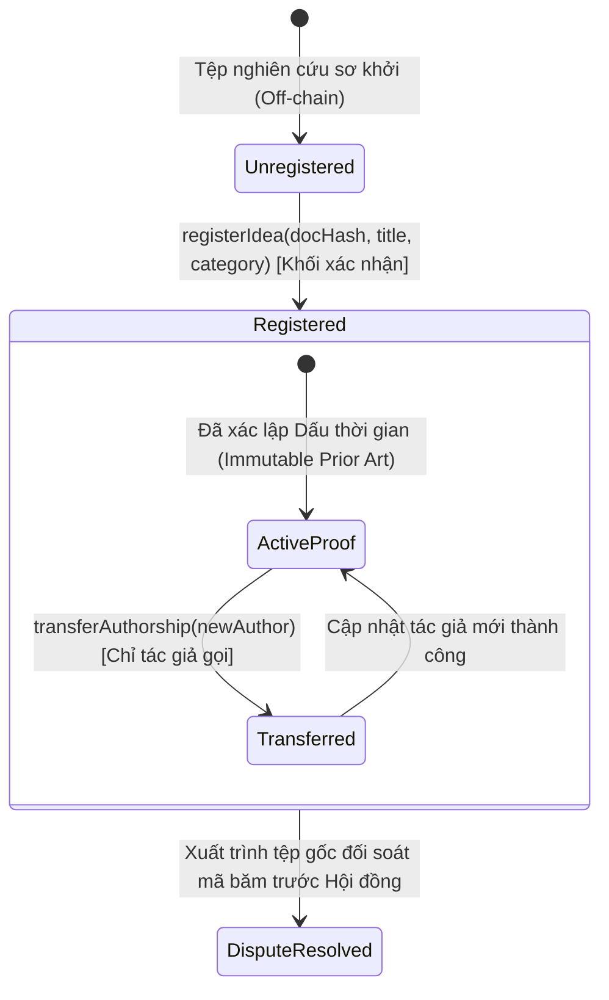

# ĐẶC TẢ NGHIỆP VỤ HỆ THỐNG (SPEC.MD)
## NỀN TẢNG BẢO CHỨNG QUYỀN TÁC GIẢ Ý TƯỞNG NGHIÊN CỨU KHOA HỌC (HCE-SCHOLARPROOF)

* **Tên dự án:** **HCE-ScholarProof**
* **Chủ đề Capstone:** Chủ đề 8 — Ghi nhận quyền tác giả của ý tưởng nghiên cứu khoa học (Proof of Authorship & Timestamping)
* **Khoa:** Hệ thống Thông tin Kinh tế — Trường Đại học Kinh tế, Đại học Huế
* **Nhóm sinh viên thực hiện:**
  1. **Lê Văn Quang Huy** — MSSV: `23K4300010` (Kỹ sư Hợp đồng Thông minh & Đặc tả Nghiệp vụ)
  2. **Lại Vương Gia Bảo** — MSSV: `23K4300024` (Kỹ sư Kiểm thử Tự động & Giao diện Web3 DApp)
* **Phiên bản tài liệu:** `v2.0` (Đã qua kiểm toán Lab 10)
* **Quy chuẩn tuân thủ:** [AGENTS.md](./AGENTS.md)

---

## 1. Mục đích và Tuyên ngôn Giá trị (Purpose & Value Proposition)

Nền tảng **HCE-ScholarProof** được thiết kế nhằm giải quyết triệt để rủi ro bị chiếm đoạt ý tưởng nghiên cứu (Idea Scooping) và tranh chấp bản quyền học thuật sơ khởi tại môi trường đại học:
* Xác lập **Bằng chứng tồn tại mật mã (Proof of Existence)** và **Dấu thời gian bất biến (Immutable Timestamping)** trên mạng lưới blockchain công khai.
* Bảo vệ quyền riêng tư tuyệt đối (Privacy-preserving): Toàn bộ nội dung tệp nghiên cứu (PDF, DOCX, Data sheet) được tính toán mã băm Keccak-256 ngay tại trình duyệt của tác giả. Hệ thống chỉ ghi nhận chuỗi băm 32 bytes (`docHash`) lên Smart Contract, không lưu trữ tệp gốc, không bộc lộ bí mật công trình ra công chúng.
* Giảm thiểu tối đa chi phí xác lập bản quyền từ hàng triệu đồng (thủ tục hành chính truyền thống) xuống mức vi mô (~1.000 VNĐ trên mạng Lớp 2 hoặc 0 VNĐ trên Sepolia Testnet).

---

## 2. Các Tác nhân & Vai trò trong Hệ thống (Actors & Roles)

1. **Tác giả Sáng lập (Original Author):** Cá nhân hoặc nhóm nghiên cứu sở hữu ý tưởng sơ bộ; ký giao dịch bằng ví Web3 (MetaMask) để đăng ký mã băm đầu tiên lên hệ thống.
2. **Chủ sở hữu Hợp pháp (Current Owner / Co-author):** Cá nhân hoặc đơn vị (ví dụ: Trường ĐH Kinh tế, Quỹ tài trợ đề tài) được tác giả chuyển nhượng quyền sở hữu trí tuệ qua hàm `transferAuthorship`.
3. **Bên Thẩm định / Công chúng (Verifier / Public):** Hội đồng khoa học, nhà bình duyệt (peer-reviewer) hoặc sinh viên khác muốn đối soát tính nguyên bản của tài liệu bằng cách tải tệp lên để băm và tra cứu trạng thái on-chain.
4. **Hợp đồng Thông minh (Smart Contract - ScholarProof.sol):** Sổ cái độc lập, tự động hóa, phi tập trung (không có quyền backdoor rug-pull).

---

## 3. Danh mục Quy tắc Nghiệp vụ Cốt lõi (Core Business Rules R1 – R8)

* **Quy tắc R1 (Băm ngoại chuỗi & Bảo mật tệp):** Mọi tài liệu nghiên cứu phải được băm bằng thuật toán mật mã chuẩn (Keccak-256 / SHA-256) tại client. Không bao giờ gửi nội dung tệp lên Smart Contract hay máy chủ tập trung.
* **Quy tắc R2 (Xác lập quyền ưu tiên đầu tiên - First-to-File):** Mã băm `docHash` hợp lệ chỉ được đăng ký duy nhất một lần trên sổ cái. Địa chỉ ví ký giao dịch đầu tiên (`msg.sender`) sẽ được vĩnh viễn ghi nhận là tác giả sáng lập ban đầu cùng mốc thời gian khối (`block.timestamp`).
* **Quy tắc R3 (Chống trùng lặp & Đạo văn - Anti-Scooping):** Mọi nỗ lực nộp lại một mã băm đã tồn tại trên hệ thống (dù đổi tiêu đề hay đổi tên tác giả) đều bị hợp đồng từ chối và Revert ngay lập tức với lỗi `IdeaAlreadyRegistered`, kèm thông tin ví tác giả gốc và mốc thời gian đăng ký trước đó.
* **Quy tắc R4 (Toàn vẹn dữ liệu đầu vào - Input Sanitization):**
  - Mã băm `docHash` không được là chuỗi rỗng `bytes32(0)`.
  - Tiêu đề (`title`) không được rỗng và không vượt quá `200` ký tự.
  - Lĩnh vực nghiên cứu (`category`) không được vượt quá `100` ký tự nhằm chống tấn công làm phình bộ nhớ Storage (Storage Bloat Attack).
* **Quy tắc R5 (Minh bạch Sự kiện - Event Transparency):** Mọi giao dịch làm biến đổi trạng thái (đăng ký mới, chuyển giao quyền tác giả) bắt buộc phải phát ra `event` có đánh dấu `indexed` trường `docHash` và `author` để phục vụ đồng bộ dữ liệu thời gian thực cho Web3 DApp.
* **Quy tắc R6 (Chuyển giao quyền tài sản trí tuệ - Authorship Transfer):** Chỉ tác giả hiện tại mới có quyền chuyển giao quyền sở hữu ý tưởng cho một địa chỉ ví mới hợp lệ (`newAuthor != address(0)` và `newAuthor != msg.sender`).
* **Quy tắc R7 (Tra cứu mở & Miễn phí gas - Public Verification):** Hàm kiểm tra `verifyIdea(docHash)` và `isIdeaRegistered(docHash)` là các hàm chỉ đọc (`view`), cho phép bất kỳ ai trong xã hội tra cứu miễn phí không tốn gas.
* **Quy tắc R8 (Phi tập trung hóa - Zero Centralization Backdoor):** Chủ sở hữu hợp đồng (hoặc bất kỳ ai) không có quyền thu hồi, sửa đổi mốc thời gian hay can thiệp vào bản ghi quyền tác giả đã được xác lập hợp lệ.

---

## 4. Máy trạng thái Vòng đời Ý tưởng Nghiên cứu (State Machine Diagram)

---

## 5. Ma trận Nhận diện & Quản trị Rủi ro (Risk Matrix)

| Mã rủi ro | Loại rủi ro | Mức độ | Hậu quả kinh tế & kỹ thuật | Cơ chế kiểm soát trong Smart Contract |
| :---: | :--- | :---: | :--- | :--- |
| **RSK-01** | **Chiếm đoạt ý tưởng (Idea Scooping)** | 🔴 **Nghiêm trọng** | Kẻ gian ăn trộm bản thảo và nhận vơ là của mình trước hội đồng xét duyệt. | Quy tắc **R2 & R3**: Sổ cái lưu `block.timestamp` bất biến. Kẻ gian nộp sau sẽ bị Revert lỗi `IdeaAlreadyRegistered`. |
| **RSK-02** | **Lộ lọt bí mật nghiên cứu** | 🔴 **Nghiêm trọng** | Đề tài bị lộ trước khi hoàn thành công bố quốc tế. | Quy tắc **R1**: Chỉ lưu chuỗi băm Keccak-256 32 bytes (hàm một chiều), nội dung file không rời khỏi máy tính tác giả. |
| **RSK-03** | **Spam Storage & Làm cạn Gas (Storage Bloat)** | 🟡 **Trung bình** | Kẻ xấu gửi chuỗi tiêu đề dài hàng Megabytes gây tốn bộ nhớ và nghẽn mạng. | Quy tắc **R4**: Giới hạn cứng `MAX_TITLE_LENGTH = 200`, `MAX_CATEGORY_LENGTH = 100`. |
| **RSK-04** | **Ủy quyền sai trái / Rug-pull quyền tác giả** | 🔴 **Nghiêm trọng** | Kẻ lạ gọi hàm đánh cắp quyền tác giả của người khác. | Quy tắc **R6**: Kiểm tra nghiêm ngặt `if (record.author != msg.sender) revert NotAuthor()`. |
| **RSK-05** | **Rủi ro Front-running tại Mempool công khai** | 🟡 **Trung bình** | Bot MEV nhìn thấy giao dịch nộp hash trong mempool và trả gas cao để tranh nộp trước. | Khuyến nghị giải pháp pha 2: Cơ chế Commit-Reveal kèm chữ ký số cá nhân (EIP-712). |

---

## 6. Danh mục 3 Ca kiểm thử Nghiêm ngặt (Test Cases TC-01 – TC-03)

1. **TC-01 (Happy Path - Luồng chuẩn):** Tác giả A nộp tệp đề cương mới với mã băm `0x3a...` hợp lệ -> Hợp đồng ghi nhận thành công, phát sự kiện `IdeaRegistered`, lưu đúng ví A và số khối.
2. **TC-02 (Fraud Case - Ca gian lận chiếm đoạt):** Kẻ mạo danh B thấy đề cương của A, cố tình gọi `registerIdea` với cùng mã băm `0x3a...` -> Giao dịch bị **Revert** với lỗi `IdeaAlreadyRegistered(0x3a..., ví A, timestamp)`.
3. **TC-03 (Boundary & Access Control Case - Ca biên & Sai quyền):**
   - Người dùng nộp mã băm rỗng `bytes32(0)` hoặc tiêu đề rỗng `""` -> Bị chặn với lỗi `InvalidDocHash()` hoặc `EmptyTitle()`.
   - Kẻ lạ C gọi `transferAuthorship` của ý tưởng thuộc về ví A -> Bị từ chối với lỗi `NotAuthor()`.

---
*Tài liệu đặc tả được xây dựng theo chuẩn mực môn học ECO2432 — TS. Hà Ngọc Long.*
