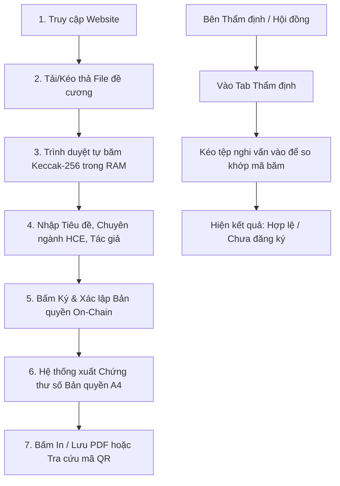

# HỒ SƠ THIẾT KẾ GIAO DIỆN & HƯỚNG DẪN HỆ THỐNG HCE-SCHOLARPROOF
## (UI/UX SPECIFICATION, USER MANUAL & AI IMAGE GENERATION PROMPT GUIDE)

* **Tên nền tảng:** **HCE-ScholarProof** *(Hệ thống Ghi nhận và Bảo chứng Quyền tác giả Ý tưởng Khoa học trên Blockchain)*
* **Đơn vị bảo trợ học thuật:** Khoa Hệ thống Thông tin Kinh tế — Trường Đại học Kinh tế, Đại học Huế
* **Học phần:** Tiền điện tử và Hợp đồng thông minh (ECO2432) — TS. Hà Ngọc Long
* **Đội ngũ phát triển:** Lê Văn Quang Huy (23K4300010) & Lại Vương Gia Bảo (23K4300024)
* **Website trực tuyến:** [https://lehuy10012005-cmd.github.io/HCE-ScholarProof/](https://lehuy10012005-cmd.github.io/HCE-ScholarProof/)

---

## PHẦN 1: TỔNG QUAN HỆ THỐNG & ĐỊNH VỊ SẢN PHẨM

### 1. Bản chất của Nền tảng (What is HCE-ScholarProof?)
HCE-ScholarProof là một ứng dụng phi tập trung (**Web3 DApp**) vận hành dựa trên cơ chế **Proof-of-Existence (Bằng chứng Tồn tại Mật mã)** và **Block Timestamping (Dấu thời gian Khối)**.
* **Mục tiêu cốt lõi:** Bảo vệ các ý tưởng nghiên cứu, đề cương khóa luận, tập dữ liệu khảo sát sơ khai của sinh viên và giảng viên khỏi nguy cơ bị **đánh cắp ý tưởng (Idea Scooping)** trước khi kịp xuất bản.
* **Nguyên tắc bảo vệ bí mật:** Tệp tài liệu nghiên cứu **tuyệt đối không bao giờ được tải lên máy chủ tập trung hay blockchain**. Trình duyệt của người dùng tự tính toán mã băm độc nhất **Keccak-256 (32 bytes)**. Chỉ mã băm này được đưa vào Smart Contract cùng mốc thời gian khối bất biến.

---

## PHẦN 2: HƯỚNG DẪN SỬ DỤNG HỆ THỐNG TỪNG BƯỚC (USER FLOW)



### Bước 1: Kết nối Ví Web3 hoặc Chế độ Mô phỏng (MetaMask)
1. Người dùng bấm nút **"Kết nối Ví"** ở góc phải thanh Header.
2. Nếu máy đã cài MetaMask: Tiện ích mở ra yêu cầu cấp quyền kết nối ví trên mạng Sepolia Testnet.
3. Nếu máy chưa cài ví: Hệ thống tự động kích hoạt **Chế độ Mô phỏng Sẵn sàng (Simulator)** sử dụng địa chỉ ví thử nghiệm của nhóm, giúp người dùng hoặc giảng viên trải nghiệm mượt mà không bị lỗi gián đoạn.

### Bước 2: Tải Tài liệu & Tính toán Vân tay số
1. Tại Tab **"Đăng ký Bản quyền Ý tưởng"**, người dùng kéo thả tệp đề cương nghiên cứu (PDF, Word, Excel, Python code, ZIP...) vào khung nét đứt.
2. Trình duyệt tự động kích hoạt hàm băm mật mã chuẩn **Keccak-256** qua Web Crypto API, trả về chuỗi hex 64 ký tự (dạng `0x8e4da68...`).
3. *(Tùy chọn tiện lợi)*: Nếu không có sẵn tệp, người dùng có thể nhấp vào 1 trong **3 Đề tài mẫu** có sẵn ở cột bên phải để hệ thống tự nạp dữ liệu.

### Bước 3: Điền Thông tin Đề tài
* **Tiêu đề công trình:** Nhập tên đề tài (tối đa 200 ký tự để chống tấn công phình bộ nhớ Storage).
* **Lĩnh vực chuyên môn tại HCE:** Chọn từ danh sách (Fintech, HTTT Kinh tế, TMĐT, Tài chính - Ngân hàng, QTKD...).
* **Nhóm tác giả & MSSV:** Ghi rõ họ tên và mã sinh viên của các thành viên.

### Bước 4: Ký Xác lập Bản quyền On-Chain & Xuất Chứng thư
1. Bấm nút màu xanh **"✍️ Ký & Xác lập Bản quyền On-Chain"**.
2. Hợp đồng kiểm tra tính duy nhất:
   * Nếu mã băm đã tồn tại trước đó: Hệ thống Revert báo lỗi nộp đè (Anti-Scooping) và hiển thị thông tin tác giả nộp trước.
   * Nếu mã băm mới: Ghi nhận vào sổ cái, tăng biến đếm tổng đề tài và phát sự kiện `IdeaRegistered`.
3. Màn hình tự động cuộn xuống và hiển thị **Chứng thư số Bản quyền Danh giá (Academic Deed)**.

### Bước 5: In ấn & Tra cứu Chứng thư
* Người dùng có thể bấm nút **"🖨️ In / Lưu Chứng thư PDF"**: Trang web tự động định dạng chuẩn khổ giấy A4 sang trọng (ẩn các nút bấm và thanh điều hướng, chỉ in khung văn bằng).
* Bấm nút **"Sao chép Mã tra cứu"** hoặc quét **mã QR** trên chứng thư để đối soát.

---

## PHẦN 3: BÓC TÁCH CHI TIẾT CÁC THÀNH PHẦN GIAO DIỆN (UI COMPONENTS)

| Thành phần UI | Vị trí & Chức năng | Phong cách Thiết kế (Styling) |
| :--- | :--- | :--- |
| **Site Header** | Cố định trên cùng (Sticky Header). Chứa Logo HCE, tên nền tảng, nhãn mạng Sepolia, nút gạt Sáng/Tối và nút ví. | Nền trắng ngà/than chì, viền nét mảnh 1px, logo HCE gradient xanh Navy. |
| **Hero Banner** | Giới thiệu giá trị cốt lõi, tuyên ngôn bảo vệ bản quyền SHTT và 4 chỉ số an ninh on-chain. | Kiểu biên tập học thuật trang nhã, typography cỡ lớn sắc sảo, không dùng ảnh nền rườm rà. |
| **Tab Navigation** | Chuyển đổi giữa 3 phân hệ: Đăng ký, Thẩm định và Sổ cái công khai. | Thanh trượt tab nét mảnh tinh tế, gạch chân xanh Navy khi active. |
| **Dropzone Upload** | Khung kéo thả tệp tài liệu nghiên cứu. | Viền nét đứt (dashed border), biểu tượng trang tài liệu, có thẻ xem trước và nút sao chép mã băm. |
| **Form Đăng ký** | Các ô nhập tiêu đề, dropdown lĩnh vực, tên tác giả và nút gửi giao dịch. | Ô nhập bo góc nhẹ (radius 10px), hiệu ứng viền xanh nhạt khi focus. |
| **Digital Certificate** | Văn bằng chứng nhận bản quyền số hóa chuẩn khổ A4. | Viền khung kép (double border) hoa văn cổ điển, dấu chìm mờ "HCE", con dấu mộc số "ON-CHAIN VERIFIED", mã QR động. |
| **Sổ cái Public Ledger** | Bảng danh sách các đề tài đã bảo chứng thời gian thực. | Bảng dữ liệu dạng Data Table chuẩn khoa học, có nhãn trạng thái xanh lục bảo. |
| **Toast System** | Thông báo kết quả thao tác trượt êm ái góc dưới màn hình. | Nền thẻ nổi (shadow-lg), viền màu phân biệt (Xanh thành công, Đỏ lỗi, Lam thông tin). |

---

## PHẦN 4: BỘ PROMPT MẪU CHO AI TẠO ẢNH (MIDJOURNEY, DALL-E 3, CHATGPT, V0.DEV)

Bạn có thể sao chép trực tiếp các đoạn câu lệnh tiếng Anh chuyên sâu dưới đây vào **Midjourney (v6)**, **DALL-E 3 (ChatGPT Plus)**, hoặc công cụ tạo UI **v0.dev / Galileo AI** để tạo ra các concept thiết kế trực quan siêu đẹp:

---

### 🎨 Prompt 1: Toàn cảnh Giao diện Web DApp Học thuật trên Desktop
> **Mục đích:** Tạo ảnh chụp màn hình (UI Mockup) trang chủ của hệ thống với phong cách Academic Fintech trang trọng.

```text
UI UX design mockup of a prestigious Academic Web3 Fintech platform called "HCE-ScholarProof", designed for Hue University of Economics. Clean, institutional modern minimalist style inspired by Mirror.xyz, Linear, and Uniswap. Editorial light mode interface with crisp white paper background, subtle slate gray 1px borders, deep academic navy blue (#1E3A8A) accents, and elegant typography. Top navigation bar features an official university crest emblem, "HCE-ScholarProof" title, a subtle green live Sepolia network pill badge, light/dark mode sun-moon toggle, and a clean MetaMask wallet connect button. Main view displays a sleek dual-column layout: left column has a minimalist dashed drag-and-drop document upload box with a Keccak-256 hash preview card, metadata form fields for research title and faculty category; right column showcases sample university research papers and an official verifiable digital certificate deed. High fidelity, dribbble trending, award-winning SaaS UI design, 8k resolution, photorealistic screen presentation, no messy neon lights, no cheap purple gradients. --ar 16:9 --v 6.0
```

---

### 🎨 Prompt 2: Chứng thư số Bản quyền A4 Danh giá (Academic Deed Certificate)
> **Mục đích:** Tạo hình ảnh văn bằng chứng nhận bản quyền số hóa để làm mẫu in ấn hoặc tài liệu minh họa bài thuyết trình.

```text
Close-up product design of an official verifiable Academic Digital Certificate of Provenance, issued by "University of Economics, Hue University" for a blockchain research copyright platform. Formal A4 academic deed layout on luxury archival off-white paper. Framed by an ornate classical navy blue double-line guilloche border. At the center, prominent Latin and Vietnamese typography reads "CHỨNG THƯ BẢO CHỨNG QUYỀN TÁC GIẢ - CERTIFICATE OF RESEARCH IDEA PROVENANCE". Faint elegant watermark crest of "HCE" in the background. Structured information fields neatly arranged in a grid: Research Title, Academic Department, Author Names and Student IDs, Cryptographic 64-character Keccak-256 Hash, Block Timestamp GMT+7, and Immutable Block Number. Bottom section features an official circular emerald green embossed stamp seal labeled "ON-CHAIN VERIFIED - HCE SMART CONTRACT" beside a crisp square cryptographic QR verification code. Prestigious, authentic legal credential aesthetic, sharp vector quality, ultra-detailed macro view, 8k. --ar 3:4 --v 6.0
```

---

### 🎨 Prompt 3: Chế độ Tối Tinh tế (Obsidian Slate Dark Mode View)
> **Mục đích:** Tạo concept giao diện Dark Mode thanh lịch không bị lòe loẹt "nhựa".

```text
Modern Web3 dashboard UI screen in premium Obsidian Slate Dark Mode for an academic copyright verification platform. Deep charcoal dark background (#0B0F19), sophisticated dark slate card surfaces (#111827), subtle border lines with 1px soft stroke. Clean, razor-sharp typography in crisp white and soft slate blue. Features an interactive document inspection tab where researchers audit the originality of scientific papers. In the center, a glowing verification success panel with emerald green status badge stating "AUTHENTICATED ON-CHAIN LEDGER", displaying block confirmation details, author wallet address, and instant timestamp reconciliation. Professional enterprise fintech feel like Stripe and GitHub, beautiful micro-interactions, clean data tables, no cheesy sci-fi neon or purple cyberpunk effects. High resolution, Figma community showcase style. --ar 16:9 --v 6.0
```

---

### 🎨 Prompt 4: Trải nghiệm trên Ứng dụng Di động (Mobile Responsive View)
> **Mục đích:** Tạo mockup giao diện điện thoại (iPhone Mockup) hiển thị giao diện DApp phản hồi mượt mà trên mobile.

```text
High-end mobile responsive UI design of the "HCE-ScholarProof" Web3 application displayed on an iPhone 16 Pro mockup resting on a clean wooden university desk. The mobile screen shows a compact, fluid mobile layout: sticky university header with hamburger menu and MetaMask wallet icon, a touch-friendly document drop area, a real-time cryptographic hash generator card, and a digital academic authenticity badge. Natural daylight studio photography setting, blurred background showing an academic notebook and fountain pen, crisp UI details, clean Apple design guidelines compliance. --ar 4:3 --v 6.0
```

---

## PHẦN 5: CÁCH DÙNG ẢNH TỪ AI ĐỂ NÂNG CẤP WEBSITE CỦA BẠN

Khi bạn dùng các câu lệnh trên để tạo ra hình ảnh từ Midjourney hoặc ChatGPT/DALL-E:
1. **Lưu ảnh về máy tính** (định dạng `.png` hoặc `.jpg`).
2. **Kéo ảnh thả vào cuộc trò chuyện này** hoặc nói cho mình biết tên file ảnh:
   * Mình sẽ phân tích bố cục, màu sắc, font chữ và các chi tiết đẹp nhất từ bức ảnh đó.
   * Mình sẽ biến nó thành mã nguồn **HTML/CSS thực tế** áp dụng thẳng vào website `web/index.html` của bạn!
3. **Ngoài ra, ngay tại đây mình cũng có công cụ tạo ảnh tích hợp**: Nếu bạn muốn mình tạo thử một ảnh concept mẫu ngay bây giờ, bạn chỉ cần ra lệnh là mình tạo được luôn nhé!
