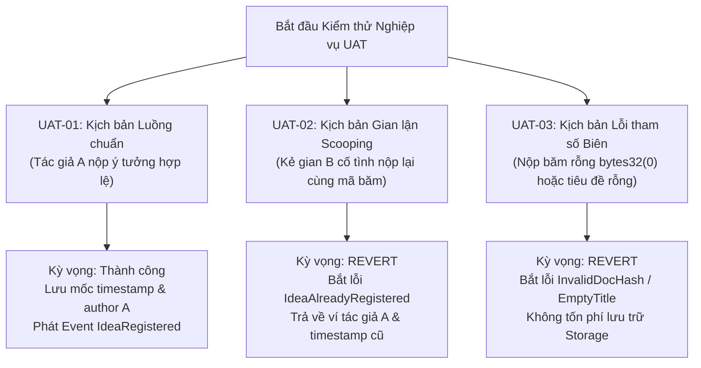

# BÁO CÁO THỰC HÀNH LAB 9: XÁC LẬP ĐẶC TẢ NGHIỆP VỤ BA FINTECH (SPEC.MD)
## ĐỒ ÁN CAPSTONE: NỀN TẢNG BẢO CHỨNG QUYỀN TÁC GIẢ Ý TƯỞNG NGHIÊN CỨU (HCE-SCHOLARPROOF)

* **Học phần:** Tiền điện tử và Hợp đồng thông minh (ECO2432)
* **Giảng viên phụ trách:** TS. Hà Ngọc Long
* **Khoa:** Hệ thống Thông tin Kinh tế — Trường Đại học Kinh tế, Đại học Huế
* **Nhóm sinh viên thực hiện:**
  1. **Lê Văn Quang Huy** — MSSV: `23K4300010` (Trưởng nhóm / Phụ trách Hợp đồng & Đặc tả)
  2. **Lại Vương Gia Bảo** — MSSV: `23K4300024` (Thành viên cặp / Phụ trách Kiểm thử & Giao diện DApp)
* **Địa chỉ ví Sepolia thử nghiệm:** `0xB07FB0761c33a01F7f7493A6a8a9667F4842Fd50`
* **Kho lưu trữ GitHub chính thức:** [https://github.com/lehuy10012005-cmd/HCE-ScholarProof](https://github.com/lehuy10012005-cmd/HCE-ScholarProof)

---

## 1. Mục tiêu và Phương pháp luận của Lab 9

Tiếp nối thành công của giai đoạn khởi động đề tài ở Lab 8, bài thực hành **Lab 9** đóng vai trò là cột mốc then chốt trong chu trình phát triển phần mềm theo phương pháp Agile/Scrum: **Chuyển hóa bài toán kinh tế học bản quyền thành bản đặc tả kỹ thuật chi tiết (Business Analyst Specification — `SPEC.md`)**.

> *"Một hợp đồng thông minh một khi đã triển khai lên blockchain là không thể sửa đổi (Immutability). Nếu đặc tả nghiệp vụ bị sai lệch hoặc có lỗ hổng logic kế toán, toàn bộ hệ thống sẽ sụp đổ và không có cơ chế hoàn tác."*  
> — **TS. Hà Ngọc Long** (Sổ tay thực hành ECO2432)

Do đó, theo đúng chuẩn mực đào tạo của môn học, nhóm nghiêm túc tuân thủ nguyên tắc: **Hoàn thiện trọn vẹn bản đặc tả và có thể kiểm thử được 100% trước khi gõ dòng code hợp đồng tiếp theo ở Lab 10.**

---

## 2. Tóm tắt các nội dung cốt lõi đã xác lập trong `SPEC.md`

Bản đặc tả chi tiết tại tệp [`SPEC.md`](./SPEC.md) đã chuẩn hóa toàn diện 6 phần nghiệp vụ:

### 2.1. Cây máy trạng thái (State Machine Model)
Vòng đời của một ý tưởng nghiên cứu khoa học trên hệ thống được mô hình hóa qua 4 trạng thái chuẩn xác:
1. `Unregistered`: Ý tưởng nằm trên máy tính của tác giả dưới dạng file đề cương (PDF/Word).
2. `Hashing`: Trình duyệt web của tác giả thực hiện băm mật mã Keccak-256 nội bộ trong RAM.
3. `Registered`: Giao dịch ghi nhận thành công on-chain, gán mã băm `docHash` vĩnh viễn với địa chỉ ví `author` và mốc thời gian khối `block.timestamp`.
4. `Verified`: Bất kỳ bên thứ ba nào xuất trình tài liệu gốc đều nhận được kết quả đối soát minh bạch với chi phí gas bằng $0\text{ VNĐ}$.

### 2.2. Bộ 8 Quy tắc nghiệp vụ On-chain (R1 – R8)
* **R1 (Client-side Hashing):** Tách rời dữ liệu nhạy cảm; không lưu trữ file lớn on-chain để tiết kiệm gas.
* **R2 (First-to-File):** Địa chỉ ví đầu tiên gửi giao dịch thành công được công nhận là tác giả sáng chế.
* **R3 (Duplicate Prevention):** Revert ngay lập tức với lỗi `IdeaAlreadyRegistered` nếu phát hiện mã băm đã tồn tại.
* **R4 (Block Timestamping):** Sử dụng thời gian khối khách quan của thợ đào/validator (`block.timestamp`), chống gian lận chỉnh đồng hồ máy tính.
* **R5 (Input Validation):** Từ chối mã băm rỗng `bytes32(0)` (`InvalidDocHash`) và tiêu đề trống (`EmptyTitle`).
* **R6 (Free Verification):** Hàm kiểm tra `verifyIdea` là hàm `view` thuần túy, hoàn toàn miễn phí cho cộng đồng.
* **R7 (Zero Centralization):** Không có quyền Admin/Owner nào được phép can thiệp, sửa đổi hay xóa bản ghi quyền tác giả.
* **R8 (Event Logging):** Phát sự kiện `IdeaRegistered` đầy đủ dữ liệu cho các ứng dụng client theo dõi thời gian thực.

---

## 3. Ma trận đối chiếu: Bằng chứng số truyền thống vs Proof of Existence Web3

| Tiêu chí đối chiếu | Quản lý truyền thống (Email / Drive / Giấy) | Giải pháp HCE-ScholarProof (Web3 Blockchain) | Ý nghĩa dưới góc nhìn Kế toán & Quản trị rủi ro |
| :--- | :--- | :--- | :--- |
| **Tính bất biến (Immutability)** | Thấp: Có thể bị sửa đổi bởi người quản trị máy chủ, IT admin hoặc chỉnh đồng hồ hệ thống. | **Tuyệt đối:** Dữ liệu nằm trên sổ cái phân tán của hàng vạn validator, không ai có thể sửa đổi sau khi đã đóng khối. | Loại trừ hoàn toàn rủi ro gian lận chứng từ và sửa mốc thời gian sáng chế. |
| **Bảo toàn quyền riêng tư** | Kém: Phải gửi toàn bộ file nội dung lên server của bên thứ ba (nguy cơ lộ ý tưởng). | **Hoàn hảo (Zero-Knowledge):** Chỉ gửi mã băm 32 bytes; nội dung công trình giữ tuyệt mật trên máy tác giả. | Bảo vệ an toàn các phát minh, công thức hoặc ý tưởng đột phá trước khi công bố. |
| **Chi phí giao dịch (Transaction Cost)** | Đắt đỏ: Nộp đơn bản quyền nhà nước tốn $1 - 2,5\text{ triệu VNĐ}$/hồ sơ. | **Siêu vi mô:** Chi phí ghi nhận trên Layer 2 chỉ khoảng **$\approx 1.000\text{ VNĐ}$**. | Bình đẳng hóa cơ hội tiếp cận bảo hộ sở hữu trí tuệ cho sinh viên nghiên cứu. |
| **Thời gian xác nhận quyền ưu tiên** | Chậm chạp: Phải chờ xét duyệt từ $6 - 18\text{ tháng}$. | **Tức thì:** Xác nhận trong vòng **$2 - 12\text{ giây}$** (1 block giao dịch). | Xác lập quyền ưu tiên (Prior Art) ngay khi ý tưởng vừa được thai nghén. |

---

## 4. Kế hoạch Kiểm thử Chấp nhận Người dùng (User Acceptance Testing - UAT)

Kế thừa bản đặc tả, nhóm đã thiết lập khung kiểm thử chấp nhận với 3 kịch bản trọng yếu sẽ được lập trình tự động trong các bài lab kế tiếp:

---

## 5. Kết luận bài Lab 9 & Sẵn sàng cho Lab 10

1. **Kết quả đạt được:** Nhóm đã hoàn thành trọn vẹn bản đặc tả nghiệp vụ [`SPEC.md`](./SPEC.md) cho đề tài Capstone Chủ đề 8 (`HCE-ScholarProof`), định hình đầy đủ máy trạng thái, 8 quy tắc on-chain và ma trận rủi ro.
2. **Kế hoạch cho Lab 10:** Kế thừa bản đặc tả `SPEC.md` này, ở Lab 10 nhóm sẽ hoàn thiện mã nguồn hợp đồng thông minh [`ScholarProof.sol`](./contracts/capstone/ScholarProof.sol) phiên bản nâng cao với OpenZeppelin Contracts v5, tối ưu hóa gas và sẵn sàng cho bộ kiểm thử tự động.

---
*Báo cáo được hoàn thiện theo đúng quy chuẩn [AGENTS.md](./AGENTS.md) của học phần ECO2432.*
