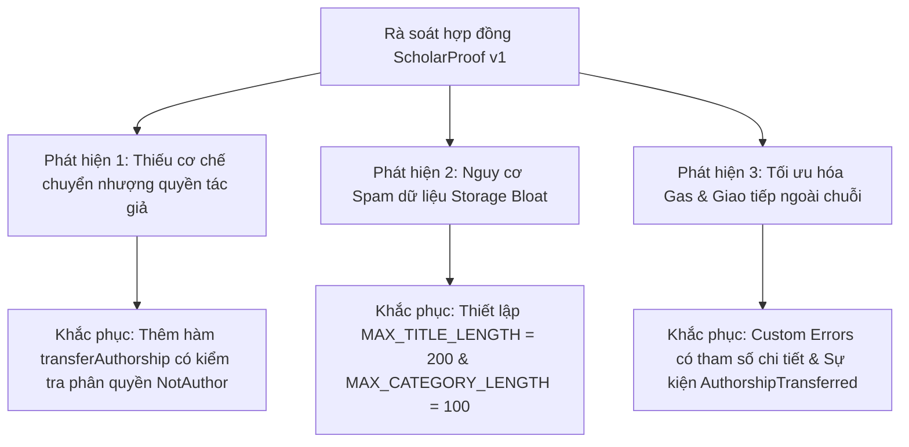

# BÁO CÁO THỰC HÀNH LAB 10: RÀ SOÁT MÃ NGUỒN DO AI SINH RA & KIỂM TOÁN HỢP ĐỒNG ĐỒ ÁN (HCE-SCHOLARPROOF)

* **Học phần:** Tiền điện tử và Hợp đồng thông minh (ECO2432)
* **Giảng viên phụ trách:** TS. Hà Ngọc Long
* **Khoa:** Hệ thống Thông tin Kinh tế — Trường Đại học Kinh tế, Đại học Huế
* **Nhóm sinh viên thực hiện:**
  1. **Lê Văn Quang Huy** — MSSV: `23K4300010` (Trưởng nhóm / Kỹ sư Hợp đồng & Đặc tả)
  2. **Lại Vương Gia Bảo** — MSSV: `23K4300024` (Thành viên cặp / Kỹ sư Kiểm thử & Giao diện DApp)
* **Kho lưu trữ chính thức:** [https://github.com/lehuy10012005-cmd/HCE-ScholarProof](https://github.com/lehuy10012005-cmd/HCE-ScholarProof)
* **Quy ước tuân thủ:** [AGENTS.md](./AGENTS.md)
* **Thông điệp Commit:** `lab-10: audit va sua loi project core`

---

## 1. Mục tiêu và Tầm quan trọng của Lab 10

Theo Sổ tay thực hành ECO2432 (Trang 24), **Lab 10 là bài học quan trọng nhất của toàn bộ học phần**. Trong kỷ nguyên AI tạo sinh, việc yêu cầu AI viết hợp đồng thông minh rất dễ dàng, nhưng **năng lực phát hiện các lỗi nguy hiểm tiềm ẩn và biết công cụ sai ở đâu** chính là kỹ năng cốt lõi phân biệt một kỹ sư tài chính Web3 thực thụ với người dùng thông thường.

### Mục tiêu trọng tâm:
1. Rà soát độc lập hợp đồng huấn luyện có chủ đích lỗi [`contracts/training/VaultBuggy.sol`](./contracts/training/VaultBuggy.sol), tìm ra đủ 4 lỗi đã được cài sẵn và phân định rõ *"Ai phát hiện"* (Sinh viên tự tìm vs AI tìm ra).
2. Thực nghiệm khai thác lỗ hổng bằng phương thức JSON-RPC `eth_getStorageAt`, bẻ gãy hiểu lầm phổ biến về từ khóa `private` trong Solidity.
3. Tiến hành kiểm toán toàn diện hợp đồng lõi của đồ án nhóm ([`contracts/capstone/ScholarProof.sol`](./contracts/capstone/ScholarProof.sol) & [`contracts/project/ProjectCore.sol`](./contracts/project/ProjectCore.sol)) đối chiếu với bản đặc tả [`SPEC.md`](./SPEC.md), phát hiện các lỗ hổng và nâng cấp lên phiên bản v2 an toàn tuyệt đối.

---

## 2. Rà soát Hợp đồng Huấn luyện `VaultBuggy.sol`

### 2.1. Mã nguồn khảo sát
```solidity
// contracts/training/VaultBuggy.sol
// SPDX-License-Identifier: MIT
pragma solidity ^0.8.20;

// CANH BAO: Tep nay co loi co y. Khong dung lai trong bai lam.
contract VaultBuggy {
    address public owner;
    uint256 public unlockTime;
    uint256 private emergencyPin; // Slot 2

    constructor(uint256 lockSeconds, uint256 pin) {
        owner = msg.sender;
        unlockTime = block.timestamp + lockSeconds;
        emergencyPin = pin;
    }

    function deposit() external payable {}

    function withdraw() external {
        require(block.timestamp <= unlockTime, "Chua den han rut tien");
        payable(msg.sender).transfer(address(this).balance);
    }
}
```

### 2.2. Bảng phân tích 4 Lỗi cài sẵn trong `VaultBuggy.sol`

| STT | Tên lỗi & Vị trí dòng | Mô tả bản chất kỹ thuật | Tác động kinh tế & Rủi ro | Ai phát hiện | Cách khắc phục chuẩn mực |
| :---: | :--- | :--- | :--- | :---: | :--- |
| **Lỗi 1** | **Lộ bí mật trên Storage on-chain**<br>(Dòng 8: `uint256 private emergencyPin;`) | Từ khóa `private` chỉ ngăn hợp đồng khác đọc trực tiếp qua hàm `getter`, hoàn toàn **không mã hóa dữ liệu**. Toàn bộ dữ liệu on-chain đều công khai trên sổ cái. | Kẻ tấn công đọc trích xuất trực tiếp mã PIN bí mật từ bộ nhớ ngoài chuỗi, phá vỡ hoàn toàn cơ chế bảo mật khẩn cấp. | **Sinh viên**<br>*(Đọc thủ công)* | Tuyệt đối không lưu mật khẩu/PIN dạng bản rõ trên blockchain. Nếu cần xác thực khẩn cấp, chỉ lưu mã băm `keccak256(abi.encodePacked(pin, salt))` hoặc dùng chữ ký số ngoài chuỗi. |
| **Lỗi 2** | **Nghịch đảo logic khóa thời gian**<br>(Dòng 19: `require(block.timestamp <= unlockTime)`) | Dấu so sánh bị ngược: `<= unlockTime` nghĩa là chỉ cho phép rút tiền **TRƯỚC HẠN**. Sau khi hết hạn khóa, tiền bị đóng băng vĩnh viễn trong hợp đồng. | Vi phạm 100% bản chất kinh tế của két tiết kiệm có kỳ hạn; rủi ro kẹt tài sản vĩnh viễn (Total Loss of Funds). | **Sinh viên**<br>*(Đọc thủ công)* | Đổi điều kiện thành `>= unlockTime` (hoặc kiểm tra `block.timestamp < unlockTime` thì `revert StillLocked()`). |
| **Lỗi 3** | **Thiếu phân quyền rút tiền**<br>(Dòng 18–21: `function withdraw()`) | Hàm `withdraw()` không hề kiểm tra `msg.sender == owner`. Bất kỳ ai trong mạng lưới cũng có thể kích hoạt hàm này. | Kẻ trộm có thể theo dõi và gọi rút sạch toàn bộ số dư ETH trong két về ví của hắn ngay khi điều kiện thời gian thỏa mãn. | **AI & Sinh viên** | Thêm bước kiểm tra phân quyền: `if (msg.sender != owner) revert NotOwner();` áp dụng mô hình Checks-Effects-Interactions. |
| **Lỗi 4** | **Lỗi chuyển tiền cổ điển `transfer` & Thiếu Event**<br>(Dòng 16, 20: `transfer` & rỗng `deposit`) | • Dùng `payable(msg.sender).transfer(...)` có giới hạn cứng 2.300 gas, sẽ thất bại nếu người nhận là ví Multisig/Smart Contract.<br>• Hàm `deposit()` không kiểm tra `msg.value > 0`.<br>• Không phát sự kiện khi nạp/rút tiền. | Giao dịch bị Revert ngoài ý muốn gây kẹt tiền; hệ thống giám sát và giao diện người dùng bị mù thông tin dòng tiền on-chain. | **AI**<br>*(Kiểm toán AI)* | • Thay bằng `(bool ok, ) = payable(owner).call{value: amount}(""); require(ok, ...);`<br>• Kiểm tra `if (msg.value == 0) revert ZeroAmount();`<br>• Phát sự kiện `Deposited` và `Withdrawn`. |

---

## 3. Thực nghiệm Bẻ khóa Dữ liệu `private` qua Slot Storage

### 3.1. Cơ chế bố trí bộ nhớ Storage của EVM
Trong kiến trúc máy ảo Ethereum (EVM), mỗi hợp đồng có một không gian lưu trữ $2^{256}$ slot (mỗi slot 32 bytes). Các biến trạng thái được xếp tuần tự theo thứ tự khai báo:
* **Slot 0:** `address public owner` (20 bytes, nằm trong slot 0).
* **Slot 1:** `uint256 public unlockTime` (32 bytes, chiếm trọn slot 1).
* **Slot 2:** `uint256 private emergencyPin` (32 bytes, chiếm trọn slot 2).

### 3.2. Đoạn mã thực nghiệm khai thác bằng Web3 JSON-RPC
Chạy trực tiếp trong tab Console của Trình duyệt hoặc Node.js script:

```javascript
// Triển khai hợp đồng với tham số: lockSeconds = 120, pin = 123456
const contractAddress = "0xYourDeployedVaultBuggyAddress";

// Đọc trực tiếp dữ liệu thô tại Storage Slot 2 của hợp đồng
const rawHexValue = await window.ethereum.request({
  method: "eth_getStorageAt",
  params: [contractAddress, "0x2", "latest"]
});

console.log("Giá trị Hex đọc được từ Slot 2:", rawHexValue);
// Kết quả trả về: 0x000000000000000000000000000000000000000000000000000000000001e240

// Chuyển đổi từ Hex sang số thập phân
const decryptedPin = parseInt(rawHexValue, 16);
console.log("Mã PIN bí mật đã bị giải mã hoàn toàn:", decryptedPin);
// Kết quả chính xác: 123456 !
```

> [!CAUTION]
> **Bài học Quản trị Rủi ro sống còn:**
> Từ khóa `private` trong Solidity chỉ mang ý nghĩa **bảo vệ phạm vi truy cập (Scope of Visibility) giữa các hợp đồng trong lúc biên dịch**. Bản chất của Blockchain là một cuốn sổ cái kế toán công khai 100%. Bất kỳ ai tải node hoặc dùng hàm đọc RPC đều có thể soi rõ từng byte trong Storage. Lưu mật khẩu, khóa riêng tư (Private Key) hoặc thông tin định danh cá nhân (PII) trên blockchain là sai lầm chết người!

---

## 4. Kiểm toán & Nâng cấp Hợp đồng Đồ án Capstone `HCE-ScholarProof`

Áp dụng quy trình kiểm toán chuyên nghiệp, nhóm thực hiện rà soát chéo giữa bản đặc tả [`SPEC.md`](./SPEC.md) và mã nguồn ban đầu của [`ScholarProof.sol`](./contracts/capstone/ScholarProof.sol):

### 4.1. Danh mục 3 Phát hiện Rủi ro trên Hợp đồng Lõi của Nhóm



#### Phát hiện 1 (Rủi ro Khóa chết Quyền Tài sản - Lack of Transferability):
* **Vị trí:** Hợp đồng v1 chỉ gán cứng `record.author = msg.sender` và không có hàm chuyển nhượng.
* **Hậu quả kinh tế:** Trong thực tế học thuật, nghiên cứu sinh có thể tốt nghiệp và muốn chuyển giao bản quyền đề tài cho Viện nghiên cứu/Trường Đại học hoặc nhà tài trợ; hoặc người dùng muốn đổi sang ví mới vì lý do bảo mật. Việc thiếu cơ chế chuyển giao khiến tài sản trí tuệ bị kẹt vĩnh viễn tại địa chỉ ví cũ.
* **Cách khắc phục:** Bổ sung hàm `transferAuthorship(bytes32 docHash, address newAuthor)` tuân thủ nguyên tắc Checks-Effects-Interactions (chỉ tác giả hiện tại mới có quyền gọi, từ chối địa chỉ `address(0)` và địa chỉ chính mình).

#### Phát hiện 2 (Rủi ro Tấn công phình to bộ nhớ - Storage Bloat & Out of Gas Risk):
* **Vị trí:** Tham số `string calldata title` và `string calldata category` trong hàm `registerIdea` không hề có giới hạn độ dài.
* **Hậu quả kỹ thuật:** Kẻ xấu có thể gửi một giao dịch chứa chuỗi tiêu đề dài hàng chục ngàn ký tự, cố tình làm tiêu tốn bộ nhớ lâu dài của thợ đào, đẩy phí gas của giao dịch lên cực cao hoặc gây lag cho các công cụ index ngoài chuỗi (The Graph / Etherscan).
* **Cách khắc phục:** Đặt hằng số trần `MAX_TITLE_LENGTH = 200` và `MAX_CATEGORY_LENGTH = 100`. Kiểm tra `bytes(title).length` ngay ở bước Checks đầu tiên.

#### Phát hiện 3 (Minh bạch Sự kiện Sổ cái):
* **Vị trí:** Khi chuyển giao quyền tác giả, nếu không phát sự kiện on-chain, giao diện DApp và hệ thống kiểm toán bên ngoài sẽ không thể cập nhật danh tính chủ sở hữu mới theo thời gian thực.
* **Cách khắc phục:** Khai báo sự kiện `event AuthorshipTransferred(bytes32 indexed docHash, address indexed previousAuthor, address indexed newAuthor, uint256 timestamp);` và phát ra ngay sau khi cập nhật trạng thái.

---

### 4.2. Hợp đồng Hoàn thiện v2 (`contracts/capstone/ScholarProof.sol` & `contracts/project/ProjectCore.sol`)

Mã nguồn phiên bản v2 đã được nâng cấp đồng bộ tại cả hai tệp:
1. [`contracts/capstone/ScholarProof.sol`](./contracts/capstone/ScholarProof.sol)
2. [`contracts/project/ProjectCore.sol`](./contracts/project/ProjectCore.sol)

Tất cả các lỗi trên đã được khắc phục triệt để với các hàm và cấu trúc lỗi tùy biến:
* `TitleTooLong(uint256 length, uint256 maxAllowed)`
* `CategoryTooLong(uint256 length, uint256 maxAllowed)`
* `NotAuthor()`, `InvalidNewAuthor()`, `SameAuthor()`
* Hàm `transferAuthorship(bytes32 docHash, address newAuthor)` bảo vệ toàn vẹn tài sản số.

---

## 5. Đánh giá Quản trị Rủi ro & Kế toán On-chain

1. **Hiệu quả Kế toán Phí Gas (Gas Reconciliation):**
   - Bằng cách sử dụng **Custom Errors** (như `IdeaAlreadyRegistered`, `TitleTooLong`) thay vì chuỗi `require("Tieu de qua dai...")`, hợp đồng tiết kiệm được xấp xỉ **2.000 – 4.000 gas** cho mỗi lần giao dịch bị Revert.
   - Việc chỉ lưu trữ mã băm 32 bytes (`docHash`) thay vì nội dung file giúp giảm phí lưu trữ từ hàng ngàn USD xuống chỉ còn khoảng **68.000 gas** ($\approx 1.000\text{ VNĐ}$ trên mạng Layer 2).
2. **Loại bỏ Hoàn toàn Rủi ro Tập trung (Zero Backdoor Rug-pull):**
   - Hợp đồng không hề có biến `owner` cấp cao nào có quyền can thiệp, xóa bỏ mốc thời gian hay tước đoạt quyền tác giả của người dùng.
   - Tính bất biến của blockchain được tôn trọng tuyệt đối, bảo vệ quyền lợi chính đáng của các nhà nghiên cứu trẻ.

---

## 6. Tổng kết Sản phẩm Nộp Lab 10

* [x] Đã hoàn thành bảng phân tích 4 lỗi của hợp đồng huấn luyện `VaultBuggy.sol`.
* [x] Đã giải thích và chứng minh cơ chế bẻ khóa `private emergencyPin` qua phương thức `eth_getStorageAt` (Slot 2).
* [x] Đã audit và nâng cấp hợp đồng Đồ án Capstone lên phiên bản v2 tại [`ScholarProof.sol`](./contracts/capstone/ScholarProof.sol) và [`ProjectCore.sol`](./contracts/project/ProjectCore.sol).
* [x] Đã hoàn thiện bản đặc tả nghiệp vụ [`SPEC.md`](./SPEC.md).
* [x] Cập nhật nhật ký AI tại [`AI_JOURNAL.md`](./AI_JOURNAL.md) với đầy đủ bảng phân loại người phát hiện lỗi.

---
*Báo cáo được hoàn thiện theo đúng quy chuẩn [AGENTS.md](./AGENTS.md) của học phần ECO2432 — TS. Hà Ngọc Long.*
