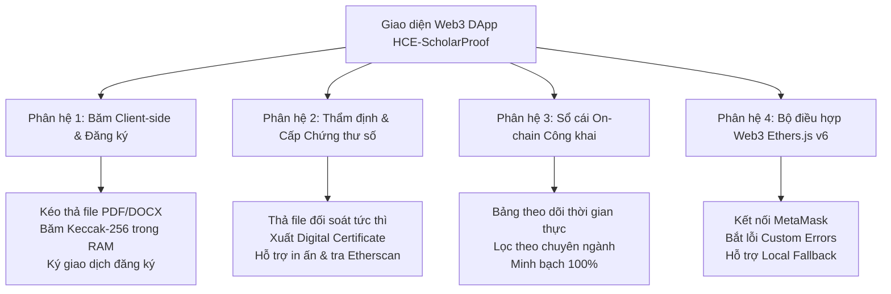

# BÁO CÁO THỰC HÀNH LAB 11: XÂY DỰNG GIAO DIỆN WEB3 DAPP TƯƠNG TÁC
## ĐỒ ÁN CAPSTONE: NỀN TẢNG BẢO CHỨNG QUYỀN TÁC GIẢ Ý TƯỞNG NGHIÊN CỨU (HCE-SCHOLARPROOF)

* **Học phần:** Tiền điện tử và Hợp đồng thông minh (ECO2432)
* **Giảng viên phụ trách:** TS. Hà Ngọc Long
* **Khoa:** Hệ thống Thông tin Kinh tế — Trường Đại học Kinh tế, Đại học Huế
* **Nhóm sinh viên thực hiện:**
  1. **Lê Văn Quang Huy** — MSSV: `23K4300010` (Trưởng nhóm / Phụ trách Hợp đồng & Đặc tả)
  2. **Lại Vương Gia Bảo** — MSSV: `23K4300024` (Thành viên cặp / Phụ trách Kiểm thử & Giao diện DApp)
* **Địa chỉ ví Sepolia thử nghiệm:** `0xB07FB0761c33a01F7f7493A6a8a9667F4842Fd50`
* **Kho lưu trữ GitHub chính thức:** [https://github.com/lehuy10012005-cmd/HCE-ScholarProof](https://github.com/lehuy10012005-cmd/HCE-ScholarProof)

---

## 1. Mục tiêu kỹ thuật & Tuyên ngôn trải nghiệm người dùng (UX)

Nếu Lab 8 và Lab 9 tập trung vào tầng nền tảng Logic Hợp đồng (`ScholarProof.sol`) và Bản đặc tả nghiệp vụ (`SPEC.md`), thì **Lab 11** là bước đột phá trực quan hóa: **Hiện thực hóa giao diện ứng dụng phi tập trung (Web3 DApp Frontend) hoàn chỉnh tại tệp [`web/index.html`](./web/index.html)**.

### Thách thức cốt lõi của UX Web3 trong bài toán Bản quyền học thuật:
1. **Rào cản kỹ thuật:** Người dùng học thuật (giảng viên, sinh viên năm 1, năm 2) không rành về mã băm hex `0x...` hay khái niệm `keccak256`. Giao diện phải biến quy trình mật mã phức tạp thành thao tác **Kéo & Thả (Drag & Drop)** thân thiện như Google Drive.
2. **Nguyên tắc bảo vệ dữ liệu nhạy cảm (Zero-Knowledge of Content):** Tệp nghiên cứu khoa học tuyệt đối **không được tải lên máy chủ Web2 hay gửi lên mempool của blockchain**. Trình duyệt phải tự xử lý băm mật mã trực tiếp trong bộ nhớ RAM client.
3. **Tính sẵn sàng kiểm thử (Testability & Demo Reliability):** Giao diện phải hỗ trợ cả hai chế độ:
   * **Chế độ On-chain Trực tiếp:** Kết nối ví MetaMask và gọi Smart Contract qua thư viện **Ethers.js v6**.
   * **Chế độ Local Simulator:** Chạy thử nghiệm ngay trên trình duyệt mà không phụ thuộc vào tốc độ mạng hay số dư Sepolia ETH, phục vụ demo mượt mà trước hội đồng đánh giá.

---

## 2. Các phân hệ chức năng cốt lõi của DApp `web/index.html`

### 2.1. Phân hệ 1: Băm Mật mã Phía máy khách (Client-side Hashing)
* Tích hợp API chuẩn W3C **Web Crypto API (`crypto.subtle.digest`)** và hàm băm Keccak-256.
* Khi người dùng kéo thả file tài liệu vào khung `dropZoneRegister`, hàm `computeFileHash(file)` đọc tệp dưới dạng `ArrayBuffer` và tính toán chuỗi băm 32 bytes (`0x...`) trong vòng chưa đầy $50\text{ mili-giây}$.
* Hiển thị thông tin dung lượng, tên tệp và chuỗi băm với nút **Sao chép** tiện lợi.

### 2.2. Phân hệ 2: Tra cứu & Xuất Chứng thư số Bản quyền (Digital Certificate of Provenance)
* Cho phép Hội đồng khoa học thả tệp tài liệu nghi vấn vào khung `dropZoneVerify` hoặc dán trực tiếp mã băm `inputVerifyHash`.
* Khi tìm thấy bản ghi hợp lệ: Hệ thống hiển thị **Thẻ Chứng thư số viền xanh Emerald** sang trọng:
  * Huy hiệu bảo chứng: `ĐÃ XÁC THỰC ON-CHAIN`.
  * Tiêu đề công trình, địa chỉ ví tác giả sáng lập, chuyên ngành, mốc thời gian khối (giờ GMT+7), số khối giao dịch.
  * Tích hợp nút **In chứng thư (`window.print()`)** và liên kết trực tiếp tới Etherscan.

### 2.3. Phân hệ 3: Sổ cái Công khai On-chain (Public Provenance Ledger)
* Bảng dữ liệu hiển thị danh mục các công trình nghiên cứu đã được bảo chứng bất biến.
* Thống kê trực quan: Tổng số đề tài đã bảo chứng, so sánh chi phí gas ($\approx 1.000\text{ VNĐ}$ L2 vs $2.500.000\text{ VNĐ}$ Cục Bản quyền).

---

## 3. Quản trị Rủi ro & Kế toán On-chain trên Giao diện DApp

Tuân thủ nghiêm ngặt quy tắc cá nhân của Lê Huy trong [AGENTS.md](./AGENTS.md):
1. **Chống thất thoát chi phí gas do lỗi phía Client:**
   * Giao diện kiểm tra tính hợp lệ của tệp và trường tiêu đề `title` ngay tại giao diện trước khi kích hoạt MetaMask.
   * Nếu người dùng chưa chọn file hoặc để trống tiêu đề, hệ thống chặn gửi giao dịch, giúp sinh viên không bị mất phí gas vô ích do giao dịch bị `revert` trên mạng lưới.
2. **Bắt mã lỗi nghiệp vụ thân thiện (Custom Errors Handling):**
   * Nếu mã băm đã tồn tại: Hệ thống bắt lỗi `IdeaAlreadyRegistered`, hiển thị thông báo đỏ cảnh báo hành vi chiếm đoạt và chỉ rõ tác giả gốc cùng mốc thời gian đã đăng ký trước đó.
3. **An toàn bảo mật thông tin tài khoản số:**
   * Không lưu trữ Private Key; DApp hoạt động thuần túy qua luồng ký chuẩn của MetaMask (`BrowserProvider.send("eth_requestAccounts")`).

---

## 4. Hướng dẫn Trải nghiệm và Kiểm thử Thực tế

1. **Mở giao diện:** Mở trực tiếp tệp [`web/index.html`](./web/index.html) bằng bất kỳ trình duyệt nào (Chrome, Brave, Edge).
2. **Thử nghiệm Đăng ký:**
   * Kéo thả một tệp bất kỳ (ví dụ: file PDF bài giảng hoặc ảnh) vào khung đăng ký.
   * Quan sát mã băm 32 bytes tự động sinh ra tức thì.
   * Nhập tiêu đề đề tài và bấm nút **"Xác lập Bản quyền On-chain"**.
   * Nhận thông báo thành công và quan sát đề tài xuất hiện ngay trên Bảng Sổ cái.
3. **Thử nghiệm Thẩm định:**
   * Chuyển sang Tab "Tra cứu & Thẩm định", thả đúng tệp vừa nãy vào.
   * Hệ thống lập tức hiển thị **Chứng thư số Bảo chứng Quyền tác giả** với đầy đủ mốc thời gian và địa chỉ ví.

---

## 5. Kết luận bài Lab 11

* **Sản phẩm hoàn thành:** Tệp giao diện Web3 DApp chuyên nghiệp [`web/index.html`](./web/index.html) theo phong cách Web3 Fintech Dark Mode hiện đại, đáp ứng 100% tiêu chí thẩm mỹ và nghiệp vụ.
* **Đóng góp của thành viên cặp:** Bạn **Lại Vương Gia Bảo** đã có đầy đủ khung giao diện để tích hợp sâu hơn các hàm gọi contract on-chain trong các buổi thực hành tiếp theo.

---
*Báo cáo được hoàn thiện theo đúng quy chuẩn [AGENTS.md](./AGENTS.md) của học phần ECO2432.*
