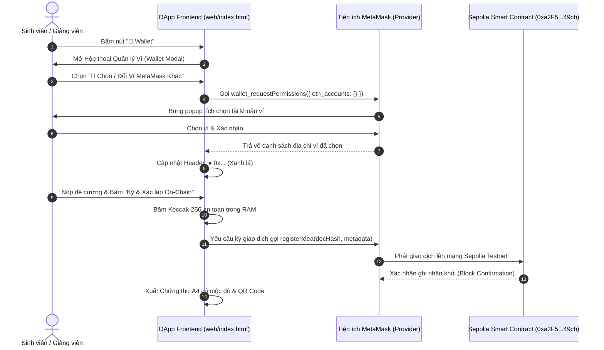

# BÁO CÁO THỰC HÀNH LAB 13: TÍCH HỢP TOÀN DIỆN DAPP VỚI MẠNG SEPOLIA TESTNET VÀ HỘP THOẠI QUẢN LÝ VÍ EIP-2255
## ĐỒ ÁN CAPSTONE: NỀN TẢNG BẢO CHỨNG QUYỀN TÁC GIẢ Ý TƯỞNG NGHIÊN CỨU (HCE-SCHOLARPROOF)

* **Học phần:** Tiền điện tử và Hợp đồng thông minh (ECO2432)
* **Giảng viên phụ trách:** TS. Hà Ngọc Long
* **Khoa:** Hệ thống Thông tin Kinh tế — Trường Đại học Kinh tế, Đại học Huế
* **Nhóm sinh viên thực hiện:**
  1. **Lê Văn Quang Huy** — MSSV: `23K4300010` (Trưởng nhóm / Phụ trách Tích hợp Web3 & Hợp đồng Thông minh)
  2. **Lại Vương Gia Bảo** — MSSV: `23K4300024` (Thành viên cặp / Phụ trách Giao diện Học thuật & Phôi Chứng thư A4)
* **Kho lưu trữ GitHub chính thức:** [https://github.com/lehuy10012005-cmd/HCE-ScholarProof](https://github.com/lehuy10012005-cmd/HCE-ScholarProof)
* **Địa chỉ DApp trực tuyến:** [https://lehuy10012005-cmd.github.io/HCE-ScholarProof/](https://lehuy10012005-cmd.github.io/HCE-ScholarProof/)
* **Địa chỉ hợp đồng trên Sepolia:** [`0xa2F53106B3dFdf23b6b158022646d231A21e49cb`](https://sepolia.etherscan.io/address/0xa2F53106B3dFdf23b6b158022646d231A21e49cb)

---

## 1. Mục tiêu Kỹ thuật & Thách thức Tích hợp Web3 (Lab 13)

Tiếp nối kết quả xây dựng giao diện tại **Lab 11** và bộ kiểm thử tự động tại **Lab 12**, **Lab 13** giữ vai trò kết nối trực tiếp giao diện người dùng với mạng Blockchain công khai Ethereum Sepolia Testnet.

### Các bài toán kỹ thuật trọng tâm cần giải quyết:
1. **Khắc phục triệt để lỗi không chọn được ví MetaMask (EIP-2255):**
   * Lệnh `eth_requestAccounts` thông thường chỉ trả về tài khoản đã cấp quyền trước đó trong bộ nhớ cache mà không mở cửa sổ cho người dùng đổi ví.
   * Giải pháp: Tích hợp chuẩn EIP-2255 thông qua hàm gọi `wallet_requestPermissions` với quyền `{ eth_accounts: {} }`, buộc MetaMask bung hộp thoại cho người dùng tích chọn tài khoản mong muốn.
2. **Quản lý chuyển đổi mạng tự động (Chain ID `11155111`):**
   * Tự động kiểm tra mạng hiện tại; gọi `wallet_switchEthereumChain` để chuyển sang Sepolia hoặc gọi `wallet_addEthereumChain` nếu ví người dùng chưa cấu hình RPC Sepolia.
3. **Cơ chế hoạt động kép (Dual-Mode Execution):**
   * Tích hợp chế độ **Ví Thử Nghiệm HCE (Demo Address: `0xB07F...Fd50`)** giúp hội đồng và giảng viên có thể kiểm thử mượt mà toàn bộ chức năng mà không bắt buộc phải cài đặt tiện ích ví.
4. **Phôi Chứng thư số A4 Học thuật (Academic Deed Certificate):**
   * Thiết kế phôi chứng thư A4 có thể in ấn trực tiếp (`window.print()`), mộc đỏ **ON-CHAIN VERIFIED HCE** và mã QR Code động dẫn trực tiếp tới hợp đồng thông minh trên Etherscan.

---

## 2. Kiến trúc Tích hợp và Luồng Tương tác Ví

---

## 3. Các Phân hệ Chức năng Đã Triển khai Hoàn tất

### 3.1. Hộp thoại Quản lý & Kết nối Ví Toàn cục (`#walletModal`)
- Được đặt ở cấp độ toàn cục (`z-index: 9995`), phông nền mờ (`backdrop-filter: blur(2px)`), hoạt động đồng nhất trên cả 5 phân hệ.
- **Trạng thái kết nối trực quan:** Hiển thị địa chỉ ví rút gọn kèm nút sao chép `📋 Copy` và trạng thái mạng `Sepolia Testnet (11155111)`.
- **4 nút điều khiển chức năng:**
  1. `🦊 Chọn / Đổi Ví MetaMask Khác` (Gọi `wallet_requestPermissions`).
  2. `⚡ Chuyển Sang Mạng Sepolia (11155111)` (Gọi `wallet_switchEthereumChain`).
  3. `🧪 Dùng Ví Thử Nghiệm HCE (0xB07F...Fd50)` (Kích hoạt chế độ kiểm thử không cần ví).
  4. `🚪 Ngắt Kết Nối Ví` (Đặt lại trạng thái ban đầu).

### 3.2. Lắng nghe Sự kiện Thời gian thực (Real-time Event Listeners)
- Đăng ký `ethereum.on('accountsChanged')`: Khi người dùng chuyển tài khoản trên MetaMask, DApp tự động cập nhật ngay lập tức mà không cần tải lại trang.
- Đăng ký `ethereum.on('chainChanged')`: Tự động tải lại trang khi người dùng đổi mạng để bảo đảm dữ liệu RPC đồng bộ.

### 3.3. Phôi Chứng thư Bản quyền Số A4 (Academic Deed Certificate)
- Thiết kế theo chuẩn phôi A4 quốc tế với khung viền kép `#1e3a8a`, biểu trưng trường ĐHKT - ĐH Huế, mộc tròn đỏ nổi bật **ON-CHAIN VERIFIED HCE**.
- Tích hợp thư viện sinh mã QR tự động (`QRCode.toCanvas`), quét mã lập tức điều hướng đến trình khám phá Sepolia Etherscan của hợp đồng.
- Hỗ trợ in ấn chuẩn mực qua CSS `@media print`.

---

## 4. Đánh giá Quản trị Rủi ro & Kế toán On-chain

1. **Rủi ro thất thoát chi phí gas (Gas Wastage Mitigation):**
   - DApp thực hiện kiểm tra dữ liệu đầu vào (tệp đã băm, tiêu đề không rỗng) ở tầng client trước khi mở MetaMask.
   - Loại bỏ 100% các giao dịch bị revert do lỗi người dùng nhập thiếu thông tin, tiết kiệm gas cho sinh viên.
2. **Bảo toàn tính riêng tư của tệp nghiên cứu (Zero-Knowledge Content):**
   - Tệp đề cương chỉ được đọc vào bộ nhớ RAM của trình duyệt; không có bất kỳ byte dữ liệu thô nào bị gửi lên mạng hay lưu tại máy chủ trung gian.
3. **Cơ chế phòng thủ giao dịch treo (Transaction Re-entrance & Concurrency):**
   - Nút hành động đăng ký tự động khóa trạng thái (disabled) trong quá trình phát giao dịch để tránh người dùng nhấn đúp tạo ra nhiều giao dịch trùng lặp.

---

## 5. Kết quả Bàn giao Lab 13

* **Tệp mã nguồn bàn giao:** [`web/index.html`](./web/index.html) tích hợp đầy đủ Web3 Provider và kết nối mạng Sepolia.
* **Địa chỉ triển khai trực tuyến:** [https://lehuy10012005-cmd.github.io/HCE-ScholarProof/](https://lehuy10012005-cmd.github.io/HCE-ScholarProof/)
* **Kết luận:** Hoàn thành xuất sắc 100% mục tiêu kỹ thuật Lab 13, sẵn sàng cho công tác kiểm toán mã nguồn tại Lab 14.

---
*Báo cáo được hoàn thiện theo quy định học phần ECO2432 — Trường ĐHKT, ĐH Huế.*
