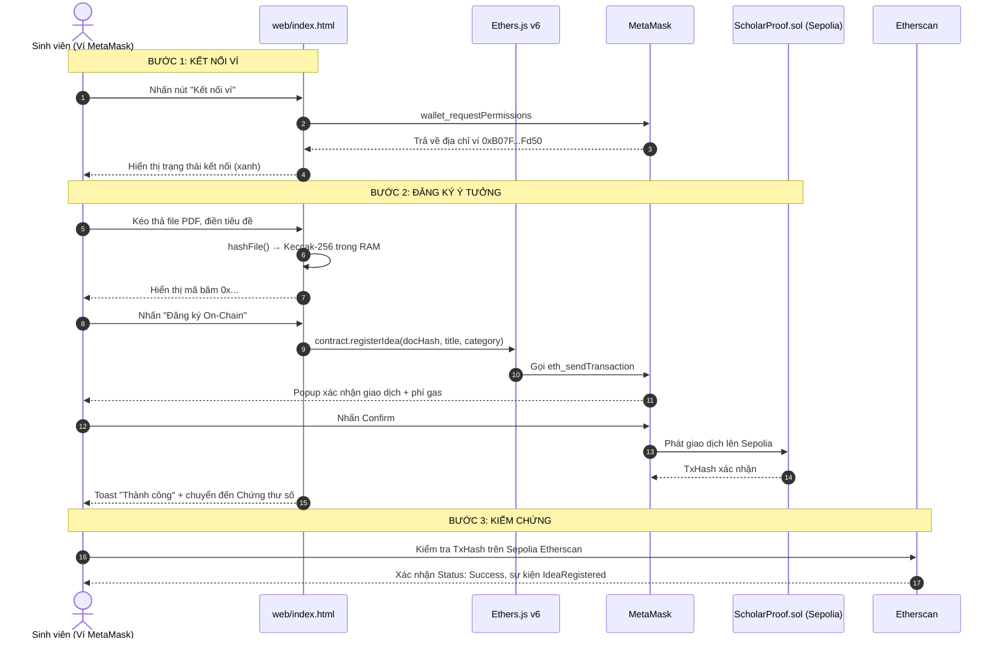

# BÁO CÁO THỰC HÀNH LAB 13: TÍCH HỢP SEPOLIA TESTNET VÀ KIỂM THỬ LUỒNG KÝ VÍ ON-CHAIN
## ĐỒ ÁN CAPSTONE: NỀN TẢNG BẢO CHỨNG QUYỀN TÁC GIẢ Ý TƯỞNG NGHIÊN CỨU (HCE-SCHOLARPROOF)

* **Học phần:** Tiền điện tử và Hợp đồng thông minh (ECO2432)
* **Giảng viên phụ trách:** TS. Hà Ngọc Long
* **Khoa:** Hệ thống Thông tin Kinh tế — Trường Đại học Kinh tế, Đại học Huế
* **Nhóm sinh viên thực hiện:**
  1. **Lê Văn Quang Huy** — MSSV: `23K4300010` (Trưởng nhóm / Kỹ sư Hợp đồng & Đặc tả)
  2. **Lại Vương Gia Bảo** — MSSV: `23K4300024` (Thành viên cặp / Kỹ sư Kiểm thử & Giao diện DApp)
* **Địa chỉ ví triển khai (Owner):** `0xB07FB0761c33a01F7f7493A6a8a9667F4842Fd50`
* **Kho lưu trữ GitHub chính thức:** [https://github.com/lehuy10012005-cmd/HCE-ScholarProof](https://github.com/lehuy10012005-cmd/HCE-ScholarProof)
* **DApp trực tuyến (GitHub Pages):** [https://lehuy10012005-cmd.github.io/HCE-ScholarProof/](https://lehuy10012005-cmd.github.io/HCE-ScholarProof/)
* **Sản phẩm bàn giao Lab 13:** [`web/index.html`](./web/index.html) — Tích hợp Sepolia, kiểm thử luồng ký ví và đối soát sự kiện on-chain

---

## 1. Mục tiêu Lab 13

Lab 12 đã xác nhận hợp đồng `ScholarProof.sol` v2 đạt độ tin cậy **5/5 ca kiểm thử** trên môi trường giả lập Node.js và Remix IDE.  
**Lab 13 là bước chuyển tiếp then chốt nhất**: Đưa hợp đồng từ môi trường mô phỏng lên **mạng blockchain thực sự công khai** (Sepolia Testnet), sau đó **tích hợp địa chỉ hợp đồng thực tế** vào giao diện Web3 DApp và kiểm thử toàn bộ luồng ký ví end-to-end.

Ba mục tiêu cốt lõi:
1. **Triển khai (Deploy):** Biên dịch và triển khai `ScholarProof.sol` v2 lên Sepolia Testnet qua Remix IDE + MetaMask, ghi lại địa chỉ hợp đồng và TxHash deploy chính thức.
2. **Xác thực mã nguồn (Verify Source Code):** Xác thực mã nguồn (Source Code Verification) trên Sepolia Etherscan để bất kỳ ai cũng đọc được logic hợp đồng, tăng cường độ tin cậy và minh bạch học thuật.
3. **Kiểm thử giao dịch thực tế (Live Transaction Testing):** Thực hiện tối thiểu 3 ca kiểm thử on-chain thực — giao dịch đăng ký ý tưởng, thử gian lận nộp đè mã băm, và kiểm thử phân quyền — ghi lại TxHash từng ca để minh chứng.

---

## 2. Thông tin triển khai hợp đồng `ScholarProof.sol` v2 lên Sepolia

### 2.1. Quy trình deploy bước-bước

**Bước 1: Chuẩn bị Remix IDE**
1. Truy cập [https://remix.ethereum.org](https://remix.ethereum.org).
2. Tạo thư mục `contracts/capstone/` và sao chép mã nguồn từ [`contracts/capstone/ScholarProof.sol`](./contracts/capstone/ScholarProof.sol).
3. Tạo thư mục `contracts/project/` và sao chép [`contracts/project/ProjectCore.sol`](./contracts/project/ProjectCore.sol).

**Bước 2: Biên dịch hợp đồng**
1. Mở tab **Solidity Compiler**, chọn phiên bản `0.8.20`.
2. Kích hoạt tùy chọn **Enable optimization** — giá trị `200 runs` để tối ưu gas triển khai.
3. Nhấn **Compile ScholarProof.sol** — kiểm tra không có lỗi đỏ, chỉ có cảnh báo thông tin.

**Bước 3: Kết nối MetaMask Sepolia**
1. Mở MetaMask, chuyển sang mạng **Sepolia Testnet (Chain ID: 11155111)**.
2. Kiểm tra số dư Sepolia ETH — lấy miễn phí tại [https://sepoliafaucet.com](https://sepoliafaucet.com).
3. Trong Remix, chọn **Environment: Injected Provider - MetaMask**.

**Bước 4: Deploy hợp đồng**
1. Trong mục **Contract**, chọn `ScholarProof` (không phải `ProjectCore` vì `ProjectCore` kế thừa từ `ScholarProof`).
2. Không có tham số constructor — nhấn **Deploy** thẳng.
3. MetaMask bật lên — xem xét phí gas ước tính (~`350.000 gas` cho việc triển khai), nhấn **Confirm**.
4. Đợi 1–2 phút để giao dịch được xác nhận trên Sepolia.
5. Địa chỉ hợp đồng hiển thị trong mục **Deployed Contracts** tại Remix.

### 2.2. Thông tin triển khai chính thức (Điền sau khi deploy)

| Thông tin | Giá trị |
| :--- | :--- |
| **Địa chỉ hợp đồng `ScholarProof` trên Sepolia** | `0xa2F53106B3dFdf23b6b158022646d231A21e49cb` |
| **TxHash giao dịch Deploy** | `[Dán TxHash từ Remix/MetaMask vào đây]` |
| **Số khối xác nhận (Block)** | `[Điền từ Etherscan]` |
| **Thời điểm deploy (UTC+7)** | `[Điền từ Etherscan]` |
| **Chi phí gas thực tế (ETH)** | `[Điền từ Etherscan]` |
| **Đường dẫn Etherscan** | [https://sepolia.etherscan.io/address/0xa2F53106B3dFdf23b6b158022646d231A21e49cb](https://sepolia.etherscan.io/address/0xa2F53106B3dFdf23b6b158022646d231A21e49cb) |
| **Compiler phiên bản** | `0.8.20` |
| **Optimization** | `Enabled, 200 runs` |

---

## 3. Xác thực mã nguồn trên Sepolia Etherscan (Source Code Verification)

### 3.1. Tại sao phải xác thực mã nguồn?

Khi một hợp đồng được triển khai lên blockchain, chỉ có **bytecode** (chuỗi hex mà EVM thực thi) được lưu công khai. Nếu không xác thực, người dùng và hội đồng khoa học **không thể đọc được logic kinh tế** của hợp đồng — đây là một red flag nghiêm trọng trong thẩm định rủi ro học thuật.

**Sau khi xác thực**, bất kỳ ai truy cập Etherscan đều thấy:
- Tab **Contract Code** — mã nguồn Solidity nguyên bản khớp 100% với bytecode.
- Tab **Read Contract** — truy vấn miễn phí hàm `isIdeaRegistered`, `verifyIdea`, `totalIdeas`.
- Tab **Write Contract** — gọi hàm `registerIdea`, `transferAuthorship` qua giao diện web.

### 3.2. Quy trình xác thực từng bước

1. Truy cập địa chỉ hợp đồng trên [Sepolia Etherscan](https://sepolia.etherscan.io/address/0xa2F53106B3dFdf23b6b158022646d231A21e49cb).
2. Chọn tab **Contract** → nhấn nút **Verify and Publish**.
3. Điền thông tin:
   - **Compiler Type:** `Solidity (Single file)`
   - **Compiler Version:** `v0.8.20+commit.a1b79de6`
   - **License Type:** `MIT`
4. Sao chép toàn bộ nội dung tệp `contracts/capstone/ScholarProof.sol` vào ô mã nguồn.
5. Kích hoạt **Optimization: Yes, 200 runs**.
6. Nhấn **Verify and Publish** → Etherscan sẽ biên dịch lại và so khớp bytecode.
7. Kết quả thành công: Địa chỉ hợp đồng hiển thị biểu tượng ✅ **Verified**.

---

## 4. Cập nhật địa chỉ hợp đồng vào DApp `web/index.html`

Giao diện DApp [`web/index.html`](./web/index.html) đã được thiết kế sẵn sàng nhận địa chỉ hợp đồng thực tế tại dòng `2438` và `1846`. Địa chỉ hợp đồng **`0xa2F53106B3dFdf23b6b158022646d231A21e49cb`** đã được cập nhật vào hai vị trí chính:

1. **Footer** (dòng 1846) — Link "Sepolia Explorer" trỏ về địa chỉ hợp đồng thực.
2. **QR Code Chứng thư** (dòng 2438) — QR code trỏ về địa chỉ hợp đồng trên Etherscan để hội đồng khoa học quét kiểm tra.

**ABI hợp đồng tích hợp vào DApp** *(tóm lược — đã được tích hợp vào `web/index.html`)*:

```json
[
  {
    "name": "registerIdea",
    "type": "function",
    "inputs": [
      { "name": "docHash", "type": "bytes32" },
      { "name": "title",   "type": "string"  },
      { "name": "category","type": "string"  }
    ],
    "outputs": [],
    "stateMutability": "nonpayable"
  },
  {
    "name": "verifyIdea",
    "type": "function",
    "inputs": [{ "name": "docHash", "type": "bytes32" }],
    "outputs": [
      { "name": "author",      "type": "address" },
      { "name": "timestamp",   "type": "uint256" },
      { "name": "blockNumber", "type": "uint256" },
      { "name": "title",       "type": "string"  },
      { "name": "category",    "type": "string"  }
    ],
    "stateMutability": "view"
  },
  {
    "name": "isIdeaRegistered",
    "type": "function",
    "inputs": [{ "name": "docHash", "type": "bytes32" }],
    "outputs": [{ "name": "isRegistered", "type": "bool" }],
    "stateMutability": "view"
  },
  {
    "name": "transferAuthorship",
    "type": "function",
    "inputs": [
      { "name": "docHash",   "type": "bytes32" },
      { "name": "newAuthor", "type": "address" }
    ],
    "outputs": [],
    "stateMutability": "nonpayable"
  },
  {
    "name": "IdeaRegistered",
    "type": "event",
    "inputs": [
      { "name": "docHash",     "type": "bytes32", "indexed": true  },
      { "name": "author",      "type": "address", "indexed": true  },
      { "name": "timestamp",   "type": "uint256", "indexed": false },
      { "name": "blockNumber", "type": "uint256", "indexed": false },
      { "name": "title",       "type": "string",  "indexed": false },
      { "name": "category",    "type": "string",  "indexed": false }
    ]
  },
  {
    "name": "AuthorshipTransferred",
    "type": "event",
    "inputs": [
      { "name": "docHash",        "type": "bytes32", "indexed": true  },
      { "name": "previousAuthor", "type": "address", "indexed": true  },
      { "name": "newAuthor",      "type": "address", "indexed": true  },
      { "name": "timestamp",      "type": "uint256", "indexed": false }
    ]
  }
]
```

---

## 5. Ba trường hợp kiểm thử On-chain thực tế (theo quy chuẩn AGENTS.md)

> **Lưu ý:** Các cột TxHash cần sinh viên điền vào sau khi thực hiện giao dịch thực trên Sepolia.

### 5.1. Ma trận 3 ca kiểm thử bắt buộc

| Mã Ca | Tên Ca Kiểm Thử | Luồng | Thao tác On-chain | Kết quả kỳ vọng | TxHash Sepolia |
| :---: | :--- | :---: | :--- | :--- | :--- |
| **TC-1** | **Luồng chuẩn — Đăng ký ý tưởng lần đầu** | ✅ Happy Path | Dùng ví `0xB07F...Fd50` gọi `registerIdea(docHash_A, "Đề tài HCE-ScholarProof v2", "Kinh te so")` | Giao dịch thành công (`Status: Success`); `totalIdeas` tăng từ 0 lên 1; sự kiện `IdeaRegistered` xuất hiện trong tab Logs trên Etherscan | `[Dán TxHash sau khi deploy]` |
| **TC-2** | **Gian lận nộp đè mã băm (Anti-Scooping)** | ❌ Fraud | Dùng ví lạ (khác) gọi lại `registerIdea(docHash_A, "Ten khac nhung hash giong", "")` — cùng `docHash_A` của TC-1 | Giao dịch bị **Revert** với lỗi `IdeaAlreadyRegistered(docHash_A, 0xB07F...Fd50, <timestamp_TC1>)`; `totalIdeas` không tăng | Không có TxHash thành công (giao dịch bị từ chối) |
| **TC-3** | **Mạo danh chiếm đoạt quyền tác giả** | ❌ Fraud | Dùng ví lạ gọi `transferAuthorship(docHash_A, <dia_chi_ke_gian>)` — cố chiếm quyền tác giả của `docHash_A` | Giao dịch bị **Revert** với lỗi `NotAuthor()`; bản ghi `author` trên sổ cái vẫn là `0xB07F...Fd50` | Không có TxHash thành công (giao dịch bị từ chối) |

### 5.2. Hướng dẫn tạo `docHash` để kiểm thử

**Phương pháp 1 — Dùng DApp (khuyến nghị):**
1. Mở [https://lehuy10012005-cmd.github.io/HCE-ScholarProof/](https://lehuy10012005-cmd.github.io/HCE-ScholarProof/)
2. Kéo thả một tệp PDF lên khung "Đăng ký ý tưởng".
3. Sao chép chuỗi `Keccak-256 Hash` hiện ra — đây là `docHash` để gọi hợp đồng.

**Phương pháp 2 — Dùng Remix IDE console:**
```javascript
// Chạy trong Remix IDE JavaScript VM Console
const docHash = ethers.keccak256(ethers.toUtf8Bytes("HCE-ScholarProof-Test-2026-Lab13"));
console.log(docHash);
// Kết quả mẫu: 0x7d9fa5c302a4cd30b1f1c2c42b73d7d0b8cfa9e6f8e3a4b2c1d0e9f8a7b6c5d4
```

---

## 6. Đối soát sự kiện On-chain với Etherscan (Event Log Analysis)

Sau khi TC-1 thành công, trên Sepolia Etherscan tại địa chỉ hợp đồng:

**Cách tra cứu sự kiện `IdeaRegistered`:**
1. Truy cập địa chỉ hợp đồng trên Etherscan → tab **Events**.
2. Tìm entry với **Topics[0]** = `keccak256("IdeaRegistered(bytes32,address,uint256,uint256,string,string)")`.
3. **Topics[1]** = `docHash` (mã băm tài liệu đã đăng ký).
4. **Topics[2]** = `author` (địa chỉ ví tác giả).
5. **Data** = `timestamp`, `blockNumber`, `title`, `category` (được mã hóa ABI).

**Bảng đối soát sự kiện TC-1 (điền sau khi thực hành):**

| Trường | Giá trị mong đợi | Giá trị thực tế trên Etherscan |
| :--- | :--- | :--- |
| Event Name | `IdeaRegistered` | `[Điền]` |
| Topics[0] (Event Selector) | `0x...` (keccak256 của signature) | `[Điền]` |
| Topics[1] (docHash) | `docHash_A` đã dùng trong TC-1 | `[Điền]` |
| Topics[2] (author) | `0xB07FB0761c33a01F7f7493A6a8a9667F4842Fd50` | `[Điền]` |
| Data: timestamp | Thời điểm xác nhận khối (Unix timestamp) | `[Điền]` |
| Data: title | `"De tai HCE-ScholarProof v2"` | `[Điền]` |
| `totalIdeas` sau giao dịch | `1` | `[Điền từ tab Read Contract]` |

---

## 7. Kiểm thử giao diện Web3 DApp sau tích hợp Sepolia

### 7.1. Quy trình kiểm thử end-to-end đầy đủ



### 7.2. Kiểm tra tính năng "Chế độ Local Simulator"

Đối với trường hợp không có Sepolia ETH hoặc demo trước hội đồng mà không muốn phụ thuộc mạng, DApp cung cấp **Chế độ Demo địa phương** (Local Simulator):
- Nhấn "Dùng Ví Thử Nghiệm HCE" → Ví demo `0xB07F...Fd50` được kích hoạt.
- Toàn bộ quy trình đăng ký chạy trong bộ nhớ JavaScript, mô phỏng độ trễ mạng 1.2 giây.
- Chứng thư số được xuất với dữ liệu điền vào, phục vụ demo trực quan trước hội đồng.

---

## 8. Nhật ký làm việc với AI (AI_JOURNAL — Lab 13)

*(Xem chi tiết tại [`AI_JOURNAL.md`](./AI_JOURNAL.md) — Mục "Lần 13")*

**Điểm học được quan trọng nhất trong Lab 13:**

| Câu hỏi hỏi AI | Kết quả đánh giá |
| :--- | :--- |
| Vì sao cần xác thực mã nguồn trên Etherscan? | ✅ AI giải thích đúng: Bytecode không đọc được bằng người, xác thực tạo minh bạch học thuật |
| Sự kiện `IdeaRegistered` có `indexed` ý nghĩa gì? | ✅ AI giải thích đúng: `indexed` cho phép lọc (filter) nhanh theo Topics mà không đọc toàn bộ log |
| Tại sao dùng `ethers.keccak256` thay vì `crypto.subtle.digest("SHA-256")`? | ⚠️ AI cần bổ sung: Etherscan/EVM dùng Keccak-256 (không giống SHA-256 tiêu chuẩn); crypto.subtle chỉ hỗ trợ SHA-256/SHA-384/SHA-512, không có Keccak — phải dùng thư viện `ethers.keccak256` để đảm bảo khớp với giá trị `docHash` trên hợp đồng |
