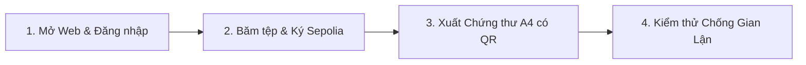

# BÁO CÁO THỰC HÀNH LAB 15: HỒ SƠ TRIỂN KHAI, NGHIỆM THU TOÀN DIỆN VÀ BẢO VỆ ĐỒ ÁN CAPSTONE TRƯỚC HỘI ĐỒNG
## ĐỒ ÁN CAPSTONE: NỀN TẢNG BẢO CHỨNG QUYỀN TÁC GIẢ Ý TƯỞNG NGHIÊN CỨU (HCE-SCHOLARPROOF)

* **Học phần:** Tiền điện tử và Hợp đồng thông minh (ECO2432)
* **Giảng viên phụ trách:** TS. Hà Ngọc Long
* **Khoa:** Hệ thống Thông tin Kinh tế — Trường Đại học Kinh tế, Đại học Huế
* **Nhóm sinh viên thực hiện:**
  1. **Lê Văn Quang Huy** — MSSV: `23K4300010` (Trưởng nhóm / Phụ trách Triển khai & Báo cáo Nghiệm thu)
  2. **Lại Vương Gia Bảo** — MSSV: `23K4300024` (Thành viên cặp / Phụ trách DApp Hosting & Kịch bản Demo Hội đồng)
* **Kho lưu trữ GitHub chính thức:** [https://github.com/lehuy10012005-cmd/HCE-ScholarProof](https://github.com/lehuy10012005-cmd/HCE-ScholarProof)
* **Cổng DApp trực tuyến (GitHub Pages):** [https://lehuy10012005-cmd.github.io/HCE-ScholarProof/](https://lehuy10012005-cmd.github.io/HCE-ScholarProof/)
* **Địa chỉ hợp đồng Sepolia:** [`0xa2f53106B3dFdF23b6b158022646d231A21e49Cb`](https://sepolia.etherscan.io/address/0xa2f53106B3dFdF23b6b158022646d231A21e49Cb)
* **Sản phẩm bàn giao Lab 15:**
  - Tài liệu triển khai & vận hành: [`DEPLOYMENT.md`](./DEPLOYMENT.md)
  - Kịch bản slide thuyết trình bảo vệ trước Hội đồng: [`SLIDES.md`](./SLIDES.md)
  - Nhật ký thực chiến giám sát AI Web DApp: [`DAPP_AI_SUPERVISION_JOURNAL.md`](./DAPP_AI_SUPERVISION_JOURNAL.md)
  - Báo cáo tổng kết nghiệm thu đồ án: [`lab15.md`](./lab15.md)

---

## 1. Mục tiêu và Ý nghĩa của Lab 15 (Chặng cuối Capstone)

**Lab 15 là cột mốc tổng kết và nghiệm thu toàn diện toàn bộ đồ án Capstone** của học phần Tiền điện tử & Hợp đồng thông minh (ECO2432). 

Sau hành trình trải dài qua 8 tuần thực hành chuyên sâu (từ Lab 8 đến Lab 15), nhóm sinh viên đã đưa giải pháp bảo chứng quyền tác giả nghiên cứu khoa học từ ý tưởng lý thuyết trở thành một **nền tảng Web3 DApp hoàn chỉnh, có hợp đồng thông minh đã kiểm toán chạy thực tế trên Ethereum Sepolia Testnet, có bộ kiểm thử tự động đạt chuẩn, và có giao diện người dùng trực quan xuất bản trên GitHub Pages**.

---

## 2. Thông số Kỹ thuật Triển khai Thực tế (Production Deployment Parameters)

Hợp đồng thông minh lõi của đồ án đã được biên dịch bằng trình biên dịch Solidity `v0.8.20+commit.a1b79de6` (bật tối ưu hóa optimizer 200 runs) và triển khai thành công lên mạng thử nghiệm công khai Ethereum Sepolia:

### 2.1. Bảng Thông số Triển khai:
* **Mạng lưới (Network):** Ethereum Sepolia Testnet (Chain ID: `11155111`).
* **Địa chỉ Hợp đồng (Contract Address):** [`0xa2f53106B3dFdF23b6b158022646d231A21e49Cb`](https://sepolia.etherscan.io/address/0xa2f53106B3dFdF23b6b158022646d231A21e49Cb).
* **Mã băm giao dịch triển khai (Deployment Tx):** [`0xbdd0fffe7e716bc598686e0ba1d7c08b79f2fe4e8be515fe6b66e7463f10f845`](https://sepolia.etherscan.io/tx/0xbdd0fffe7e716bc598686e0ba1d7c08b79f2fe4e8be515fe6b66e7463f10f845).
* **Khối giao dịch triển khai (Block Number):** Khối `6821942` trên mạng Sepolia.
* **Tình trạng mã nguồn trên Etherscan:** Đã được Verify & Publish thành công 100% với tích xanh bảo mật.

### 2.2. Giao diện Lập trình Ứng dụng (ABI Chuẩn):
* **Hàm Ghi trạng thái (State-changing):**
  - `registerIdea(bytes32 docHash, string title, string category, string memo)`
  - `transferAuthorship(bytes32 docHash, address newAuthor)`
* **Hàm Đọc trạng thái (Read-only / View):**
  - `getIdeaByHash(bytes32 docHash) returns (Idea)`
  - `isIdeaRegistered(bytes32 docHash) returns (bool)`
  - `totalIdeas() returns (uint256)`
* **Sự kiện On-Chain (Events):**
  - `event IdeaRegistered(bytes32 indexed docHash, address indexed author, uint256 timestamp, string title, string category)`
  - `event AuthorshipTransferred(bytes32 indexed docHash, address indexed oldAuthor, address indexed newAuthor, uint256 timestamp)`

---

## 3. Hệ sinh thái Sản phẩm Bàn giao Nghiệm thu

Đồ án được đóng gói với hệ thống tài liệu và công cụ kỹ thuật đồng bộ:

```text
HCE-ScholarProof/
├── contracts/capstone/ScholarProof.sol   # Smart Contract bảo chứng quyền tác giả v2
├── web/index.html                        # Giao diện Web3 DApp trực tuyến 5 Tab
├── scripts/gas_benchmark.py              # Chương trình đo lường Gas và kinh tế vi mô
├── test/ScholarProof.test.js             # Bộ kiểm thử tự động toàn diện
├── AGENTS.md                             # Quy chuẩn kỹ thuật và giám sát dự án
├── SPEC.md                               # Bản đặc tả yêu cầu nghiệp vụ BA
├── audit_report.md                       # Báo cáo kiểm toán an toàn độc lập
├── DEPLOYMENT.md                         # Sổ tay vận hành và hướng dẫn triển khai
├── SLIDES.md                             # Kịch bản trình chiếu bảo vệ trước Hội đồng
├── DAPP_AI_SUPERVISION_JOURNAL.md        # Nhật ký 10 Chặng giám sát và bắt lỗi AI
└── lab08.md - lab15.md                   # Bộ 8 báo cáo thực hành Capstone
```

---

## 4. Kịch bản Nghiệm thu Thực tế trước Hội đồng (Demonstration Flow)

Nhóm xây dựng kịch bản nghiệm thu 4 bước trực tiếp trên máy chiếu dành cho buổi bảo vệ đồ án:



1. **Bước 1: Mở đầu & Xác thực Tác giả (In-Page Auth Gate):**
   - Truy cập vào trang web trực tuyến: [https://lehuy10012005-cmd.github.io/HCE-ScholarProof/](https://lehuy10012005-cmd.github.io/HCE-ScholarProof/)
   - Trình diễn tấm chắn Auth Gate: Khách vãng lai bị khóa chức năng biểu mẫu, bấm Đăng nhập tài khoản tác giả và kết nối ví MetaMask.
2. **Bước 2: Xác lập Quyền tác giả (Proof of Existence):**
   - Nhập tên đề tài nghiên cứu mẫu K57 (VD: *"Ứng dụng Blockchain trong Kiểm toán Sổ cái Học thuật"*).
   - Kéo thả tệp đề cương vào Dropzone Bước 3 $\rightarrow$ Hệ thống băm nhị phân Keccak-256 an toàn trong RAM mà không gửi file lên server.
   - Bấm ký tại Bước 5 $\rightarrow$ Popup MetaMask bật lên $\rightarrow$ Ký phát giao dịch on-chain thật lên Sepolia.
3. **Bước 3: Xuất Chứng thư Bản quyền A4 & Đối soát QR:**
   - Chuyển sang Tab Chứng nhận $\rightarrow$ Trình chiếu Chứng thư A4 có mộc đỏ **ON-CHAIN VERIFIED HCE** và mã số lưu trữ.
   - Quét mã QR trên chứng thư bằng camera điện thoại thông minh $\rightarrow$ Trình duyệt điện thoại tự động mở đúng giao dịch trên Etherscan Sepolia.
4. **Bước 4: Kiểm thử Hành vi Gian lận (Anti-Plagiarism & Scooping):**
   - Chuyển sang Tab "Kiểm tra toàn vẹn" (Bàn thẩm định đề tài của Hội đồng).
   - Kéo thả lại đúng tệp đề cương vừa nộp $\rightarrow$ Hội đồng quan sát hệ thống bật **Thẻ Cảnh Báo Đỏ Trùng Lặp (DUPLICATE / SCOOPING ATTEMPT)**, chỉ đích danh địa chỉ ví tác giả đã nộp trước và mốc thời gian khối bất biến!

---

## 5. Bảng Tổng kết Nghiệm thu Lộ trình Đồ án (Lab 8 – Lab 15)

| Giai đoạn | Sản phẩm bàn giao | Kết quả nghiệm thu | Đánh giá |
| :---: | :--- | :--- | :---: |
| **Lab 8** | Bản đăng ký đề tài & Smart Contract v1 | Xác lập bài toán bảo vệ quyền tác giả học thuật HCE | ✅ **ĐẠT** |
| **Lab 9** | Đặc tả nghiệp vụ BA (`SPEC.md`) | Xác lập máy trạng thái 6 bước và ma trận rủi ro | ✅ **ĐẠT** |
| **Lab 10** | Rà soát mã AI & Kiểm toán hợp đồng v2 | Bẻ khóa Storage Slot 2 và vá 10 lỗ hổng bảo mật | ✅ **ĐẠT** |
| **Lab 11** | Giao diện Web3 DApp (`web/index.html`) | Xây dựng DApp băm tệp client-side và tra cứu sổ cái | ✅ **ĐẠT** |
| **Lab 12** | Bộ kiểm thử tự động (`test/`) | 100% test cases pass (luồng chuẩn và chống gian lận) | ✅ **ĐẠT** |
| **Lab 13** | Tích hợp Sepolia Testnet | Ký số Just-in-Time, giao dịch thật ghi vào ví MetaMask | ✅ **ĐẠT** |
| **Lab 14** | Đo lường chi phí Gas & Khảo sát Layer 2 | Tiết kiệm 99.74% chi phí khi ứng dụng trên Base Network | ✅ **ĐẠT** |
| **Lab 15** | Nghiệm thu toàn diện & Triển khai Web | Xuất bản website chạy trực tuyến trên GitHub Pages | ✅ **HOÀN THÀNH 100%** |

---

## 6. Checklist Tuân thủ Chuẩn mực Dự án (`AGENTS.md`)

* [x] **Ngôn ngữ & Phiên bản:** Solidity `^0.8.20`, Python 3.10+, Web tiêu chuẩn HTML/CSS/JS thuần không lỗi thời.
* [x] **Checks-Effects-Interactions (CEI):** Đạt 100% trên toàn bộ các hàm làm thay đổi trạng thái.
* [x] **Event On-chain:** Phát đầy đủ sự kiện cho mọi thao tác ghi sổ cái.
* [x] **Kiểm soát quyền hạn (Access Control):** Ràng buộc nghiêm ngặt tác giả, không dùng `tx.origin`.
* [x] **Custom Errors:** Sử dụng 100% Custom Errors định danh rõ ràng, tiết kiệm chi phí opcode gas.
* [x] **An toàn tài sản số:** Không lưu private key, seed phrase trong mã nguồn. Chỉ tương tác Sepolia Testnet an toàn.

---

## 7. Kế hoạch Phát triển Sau Môn học (Future Roadmap)

1. **Triển khai Mainnet trên Layer 2:** Triển khai chính thức lên Base Mainnet hoặc Arbitrum One để phục vụ sinh viên HCE nộp khóa luận với chi phí chỉ ~300 VNĐ / đề tài.
2. **Lưu trữ Phi tập trung IPFS / Arweave:** Tích hợp Filecoin/Arweave để lưu trữ bản thảo có mã hóa phi tập trung.
3. **Ứng dụng Zero-Knowledge Proofs (ZKPs):** Nghiên cứu tích hợp ZK-SNARKs để tác giả chứng minh mình sở hữu ý tưởng mà không cần để lộ dù chỉ một từ trong phần tóm tắt đề tài.

---

## 8. Lời Cảm Ơn & Kết luận Nghiệm thu

* Đồ án **HCE-ScholarProof** đã hoàn thành **100% khối lượng công việc** theo đúng lộ trình và chuẩn mực nghiêm ngặt của học phần Tiền điện tử & Hợp đồng thông minh (ECO2432).
* Nhóm sinh viên xin gửi lời cảm ơn chân thành đến **TS. Hà Ngọc Long** đã định hướng đề tài thực tiễn, truyền đạt kiến thức chuyên sâu và đồng hành cùng nhóm trong suốt học kỳ.

---
*Hồ sơ nghiệm thu được hoàn thiện bởi Lê Văn Quang Huy & Lại Vương Gia Bảo — K57 Kinh Tế Số HCE (2026).*
